# Call Flow
> **Onboarding question:** What happens during execution?


## Flow from `main`

The `main` workflow represents a critical path in the system. When this flow is triggered, execution begins in `test_main.cpp`. From there, it coordinates with 82 different components. The primary interactions involve `add`, `open`, and `Network`.

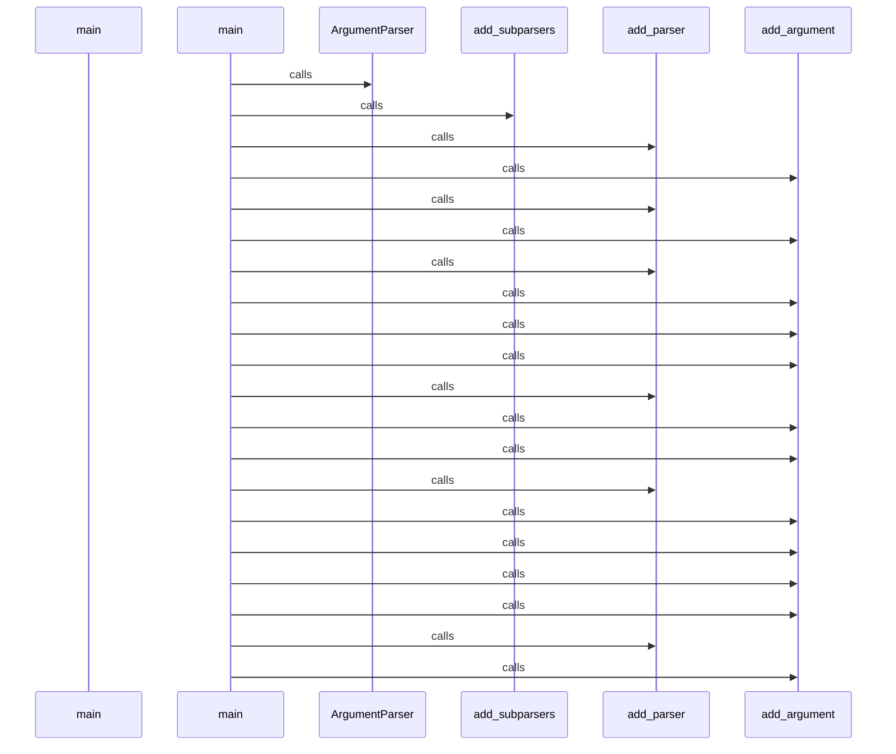

## Flow from `TestCppInheritance.test_cpp_function_calls_remain_call_kind`

The `test_cpp_function_calls_remain_call_kind` workflow represents a critical path in the system. When this flow is triggered, execution begins in `test_inheritance.py`. From there, it coordinates with 2 different components. The primary interactions involve `len` and `_parse`.

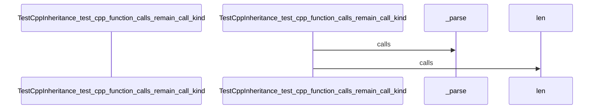

## Flow from `DBQueryAPI.get_domain_entities`

The `get_domain_entities` workflow represents a critical path in the system. When this flow is triggered, execution begins in `query_api.py`. From there, it coordinates with 11 different components. The primary interactions involve `any`, `all`, and `query`.

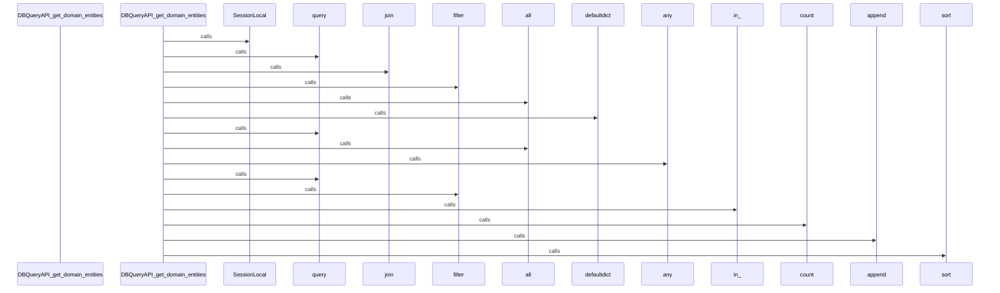

## Flow from `J.onClick`

The `onClick` workflow represents a critical path in the system. When this flow is triggered, execution begins in `tom-select.complete.min.js`. From there, it coordinates with 3 different components. The primary interactions involve `blur`, `focus`, and `clearActiveItems`.

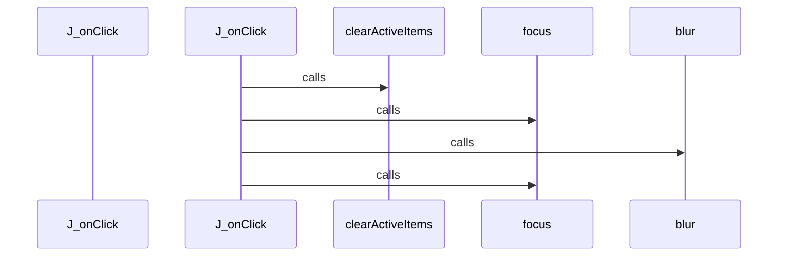

## Flow from `J.setup`

The `setup` workflow represents a critical path in the system. When this flow is triggered, execution begins in `tom-select.complete.min.js`. From there, it coordinates with 58 different components. The primary interactions involve `o`, `insertAdjacentElement`, and `create`.

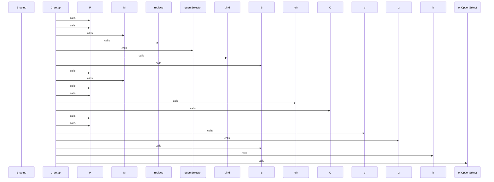

## Flow from `J.setupOptions`

The `setupOptions` workflow represents a critical path in the system. When this flow is triggered, execution begins in `tom-select.complete.min.js`. From there, it coordinates with 3 different components. The primary interactions involve `y`, `registerOptionGroup`, and `addOptions`.

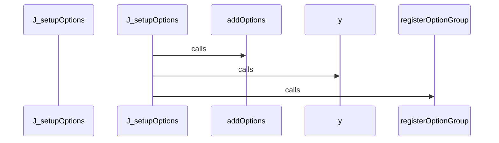

## Flow from `J.setupTemplates`

The `setupTemplates` workflow represents a critical path in the system. When this flow is triggered, execution begins in `tom-select.complete.min.js`. From there, it coordinates with 77 different components. The primary interactions involve `add`, `off`, and `has`.

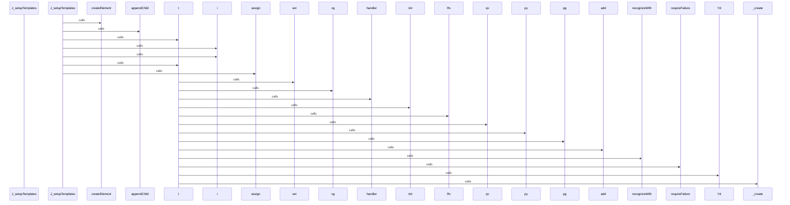

## Flow from `J.setupCallbacks`

The `setupCallbacks` workflow represents a critical path in the system. When this flow is triggered, execution begins in `tom-select.complete.min.js`. From there, it coordinates with 1 different components. The primary interactions involve `on`.

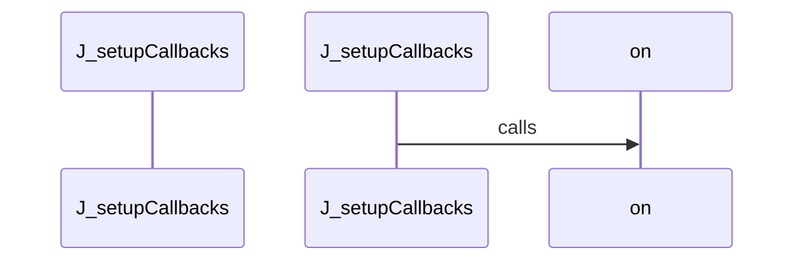

## Flow from `test_schema_setup`

The `test_schema_setup` workflow represents a critical path in the system. When this flow is triggered, execution begins in `test_manager.py`. From there, it coordinates with 5 different components. The primary interactions involve `select`, `execute`, and `all`.

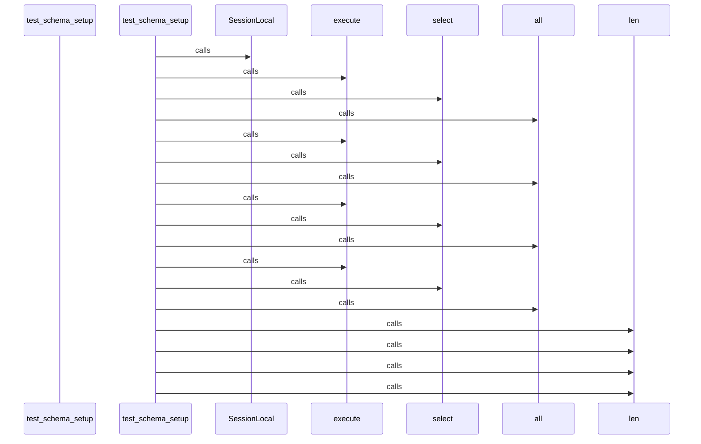

## Flow from `J.registerOption`

The `registerOption` workflow represents a critical path in the system. When this flow is triggered, execution begins in `tom-select.complete.min.js`. From there, it coordinates with 1 different components. The primary interactions involve `addOption`.

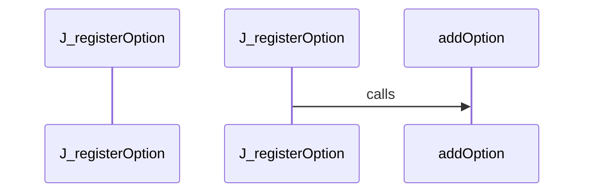

## Flow from `J.registerOptionGroup`

The `registerOptionGroup` workflow represents a critical path in the system. When this flow is triggered, execution begins in `tom-select.complete.min.js`. From there, it coordinates with 1 different components. The primary interactions involve `q`.

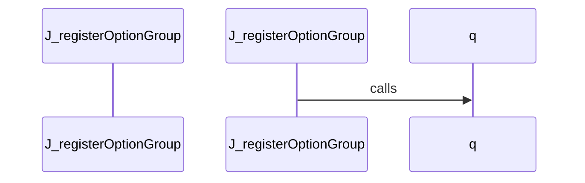

## Flow from `DBQueryAPI.get_class_hierarchy_full`

The `get_class_hierarchy_full` workflow represents a critical path in the system. When this flow is triggered, execution begins in `query_api.py`. From there, it coordinates with 6 different components. The primary interactions involve `select`, `execute`, and `all`.

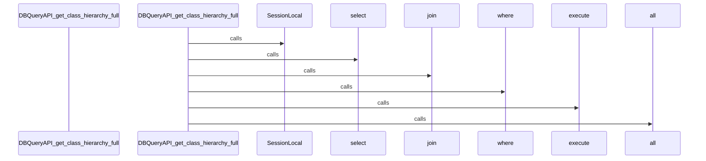

## Flow from `DBQueryAPI.get_dependency_clusters`

The `get_dependency_clusters` workflow represents a critical path in the system. When this flow is triggered, execution begins in `query_api.py`. From there, it coordinates with 1 different components. The primary interactions involve `get_module_structure`.

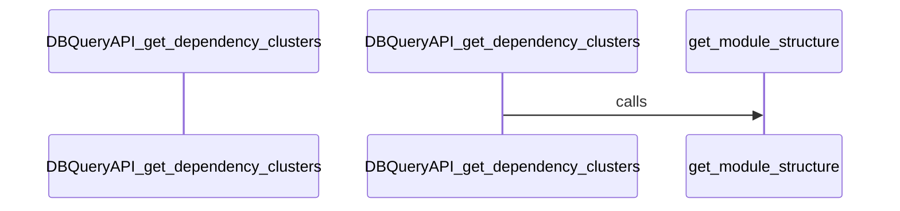

## Flow from `J.addOption`

The `addOption` workflow represents a critical path in the system. When this flow is triggered, execution begins in `tom-select.complete.min.js`. From there, it coordinates with 5 different components. The primary interactions involve `q`, `addOptions`, and `hasOwnProperty`.

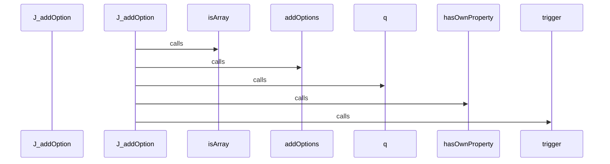

## Flow from `J.onFocus`

The `onFocus` workflow represents a critical path in the system. When this flow is triggered, execution begins in `tom-select.complete.min.js`. From there, it coordinates with 7 different components. The primary interactions involve `refreshOptions`, `H`, and `showInput`.

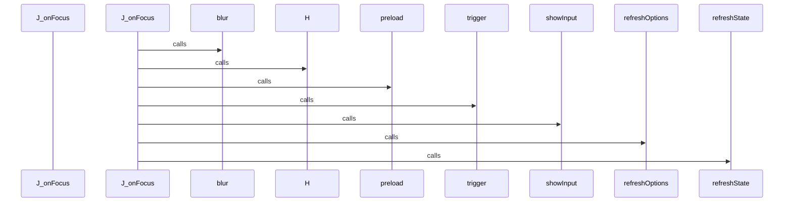

## Flow from `J.selectAll`

The `selectAll` workflow represents a critical path in the system. When this flow is triggered, execution begins in `tom-select.complete.min.js`. From there, it coordinates with 5 different components. The primary interactions involve `hideInput`, `controlChildren`, and `close`.

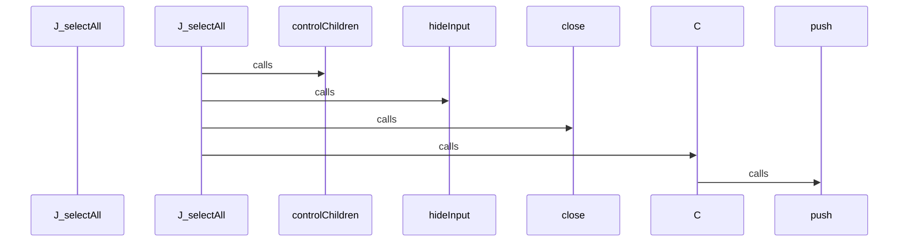

## Flow from `ModuleGuideGenerator.gather_data`

The `gather_data` workflow represents a critical path in the system. When this flow is triggered, execution begins in `module_guide.py`. From there, it coordinates with 1 different components. The primary interactions involve `get_module_structure`.

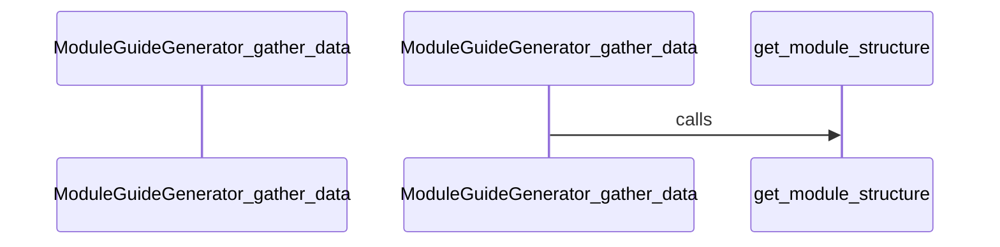

## Flow from `ProjectMapGenerator.gather_data`

The `gather_data` workflow represents a critical path in the system. When this flow is triggered, execution begins in `project_map.py`. From there, it coordinates with 1 different components. The primary interactions involve `get_module_structure`.

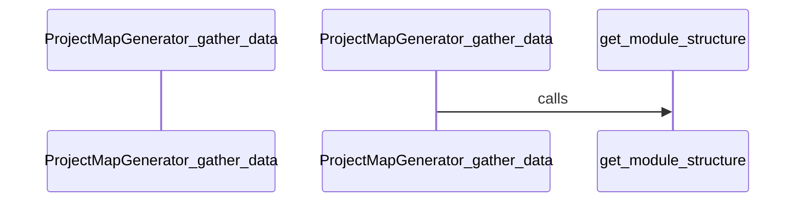

## Flow from `TestCppInheritance.test_inheritance_caller_is_child_class`

The `test_inheritance_caller_is_child_class` workflow represents a critical path in the system. When this flow is triggered, execution begins in `test_inheritance.py`. From there, it coordinates with 3 different components. The primary interactions involve `dedent`, `any`, and `_parse`.

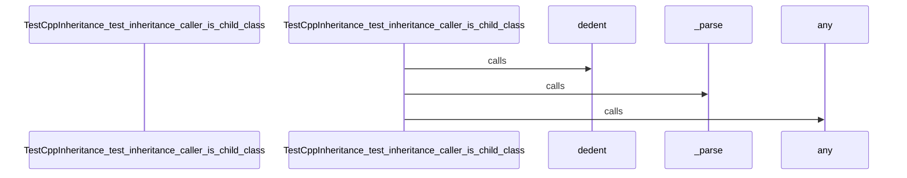

## Flow from `b.getScoreFunction`

The `getScoreFunction` workflow represents a critical path in the system. When this flow is triggered, execution begins in `tom-select.complete.min.js`. From there, it coordinates with 2 different components. The primary interactions involve `prepareSearch` and `_getScoreFunction`.

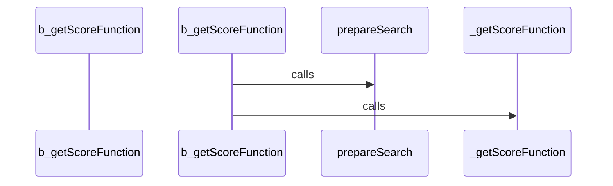

## Flow from `highlightFilter`

The `highlightFilter` workflow represents a critical path in the system. When this flow is triggered, execution begins in `utils.js`. From there, it coordinates with 8 different components. The primary interactions involve `toString`, `update`, and `selectNodes`.

```mermaid
sequenceDiagram
    participant Start as highlightFilter


    highlightFilter->>get: calls


    highlightFilter->>includes: calls


    highlightFilter->>toString: calls


    highlightFilter->>push: calls


    highlightFilter->>get: calls


    highlightFilter->>includes: calls


    highlightFilter->>toString: calls


    highlightFilter->>push: calls


    highlightFilter->>push: calls


    highlightFilter->>selectNodes: calls


    selectNodes->>selectNodes: calls


    selectNodes->>filterHighlight: calls


    filterHighlight->>get: calls


    filterHighlight->>hasOwnProperty: calls


    filterHighlight->>push: calls


    filterHighlight->>update: calls


    filterHighlight->>hasOwnProperty: calls


    filterHighlight->>push: calls


    filterHighlight->>update: calls


```

## Flow from `set_sqlite_pragma`

The `set_sqlite_pragma` workflow represents a critical path in the system. When this flow is triggered, execution begins in `manager.py`. From there, it coordinates with 3 different components. The primary interactions involve `close`, `cursor`, and `execute`.

```mermaid
sequenceDiagram
    participant Start as set_sqlite_pragma


    set_sqlite_pragma->>cursor: calls


    set_sqlite_pragma->>execute: calls


    set_sqlite_pragma->>execute: calls


    set_sqlite_pragma->>execute: calls


    set_sqlite_pragma->>execute: calls


    set_sqlite_pragma->>close: calls


```

## Flow from `test_cpp_inline_functions`

The `test_cpp_inline_functions` workflow represents a critical path in the system. When this flow is triggered, execution begins in `test_cpp.py`. From there, it coordinates with 4 different components. The primary interactions involve `extract_symbols`, `len`, and `set_language`.

```mermaid
sequenceDiagram
    participant Start as test_cpp_inline_functions


    test_cpp_inline_functions->>ASTParser: calls


    test_cpp_inline_functions->>set_language: calls


    test_cpp_inline_functions->>extract_symbols: calls


    test_cpp_inline_functions->>len: calls


```

## Flow from `test_find_callers_of_missing`

The `test_find_callers_of_missing` workflow represents a critical path in the system. When this flow is triggered, execution begins in `test_query_api_references.py`. From there, it coordinates with 3 different components. The primary interactions involve `find_callers_of`, `len`, and `isinstance`.

```mermaid
sequenceDiagram
    participant Start as test_find_callers_of_missing


    test_find_callers_of_missing->>find_callers_of: calls


    test_find_callers_of_missing->>isinstance: calls


    test_find_callers_of_missing->>len: calls


```

## Flow from `test_find_calls_by_missing`

The `test_find_calls_by_missing` workflow represents a critical path in the system. When this flow is triggered, execution begins in `test_query_api_references.py`. From there, it coordinates with 3 different components. The primary interactions involve `find_calls_by`, `len`, and `isinstance`.

```mermaid
sequenceDiagram
    participant Start as test_find_calls_by_missing


    test_find_calls_by_missing->>find_calls_by: calls


    test_find_calls_by_missing->>isinstance: calls


    test_find_calls_by_missing->>len: calls


```

## Flow from `test_js_basic_symbols`

The `test_js_basic_symbols` workflow represents a critical path in the system. When this flow is triggered, execution begins in `test_javascript.py`. From there, it coordinates with 5 different components. The primary interactions involve `dedent`, `ASTParser`, and `len`.

```mermaid
sequenceDiagram
    participant Start as test_js_basic_symbols


    test_js_basic_symbols->>ASTParser: calls


    test_js_basic_symbols->>set_language: calls


    test_js_basic_symbols->>dedent: calls


    test_js_basic_symbols->>extract_symbols: calls


    test_js_basic_symbols->>len: calls


```

## Flow from `test_qa_sloppy_shebangs`

The `test_qa_sloppy_shebangs` workflow represents a critical path in the system. When this flow is triggered, execution begins in `test_language_qa.py`. From there, it coordinates with 1 different components. The primary interactions involve `detect_language`.

```mermaid
sequenceDiagram
    participant Start as test_qa_sloppy_shebangs


    test_qa_sloppy_shebangs->>detect_language: calls


```


---
*Generated by DECODE NLG | [← Back to Index](index.md)*