# Call Flow
> **Onboarding question:** What happens during execution?


## Flow from `main`

The `main` workflow represents a critical path in the system. When this flow is triggered, execution begins in `test_main.cpp`. From there, it coordinates with 82 different components. The primary interactions involve `Session`, `write`, and `Network`.

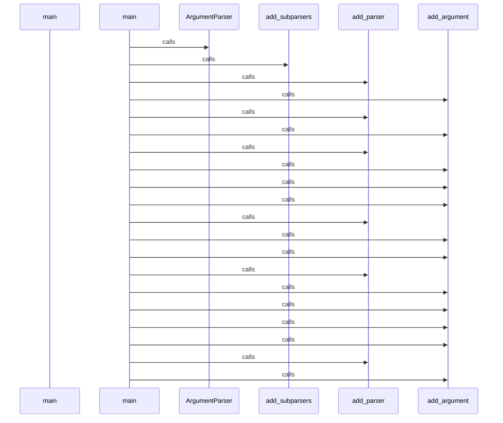

## Flow from `TestCppInheritance.test_cpp_function_calls_remain_call_kind`

The `test_cpp_function_calls_remain_call_kind` workflow represents a critical path in the system. When this flow is triggered, execution begins in `test_inheritance.py`. From there, it coordinates with 2 different components. The primary interactions involve `_parse` and `len`.

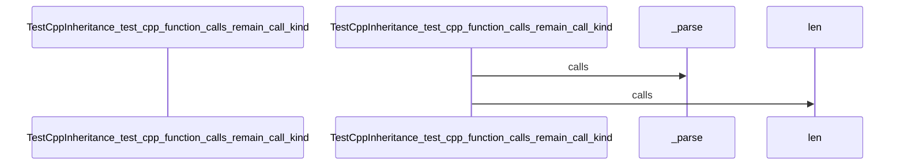

## Flow from `DBQueryAPI.get_domain_entities`

The `get_domain_entities` workflow represents a critical path in the system. When this flow is triggered, execution begins in `query_api.py`. From there, it coordinates with 11 different components. The primary interactions involve `defaultdict`, `any`, and `filter`.

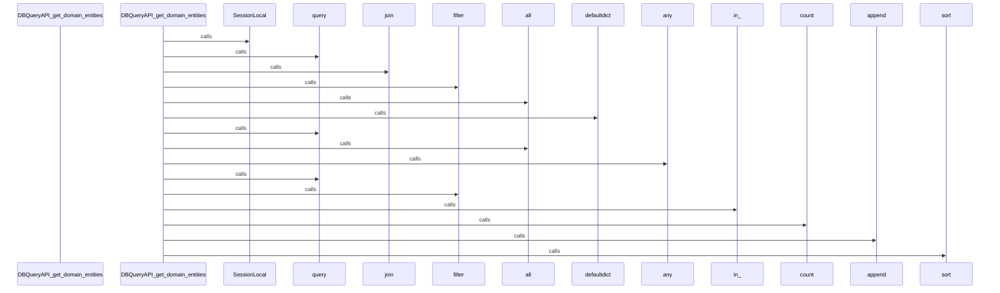

## Flow from `J.onClick`

The `onClick` workflow represents a critical path in the system. When this flow is triggered, execution begins in `tom-select.complete.min.js`. From there, it coordinates with 3 different components. The primary interactions involve `blur`, `focus`, and `clearActiveItems`.

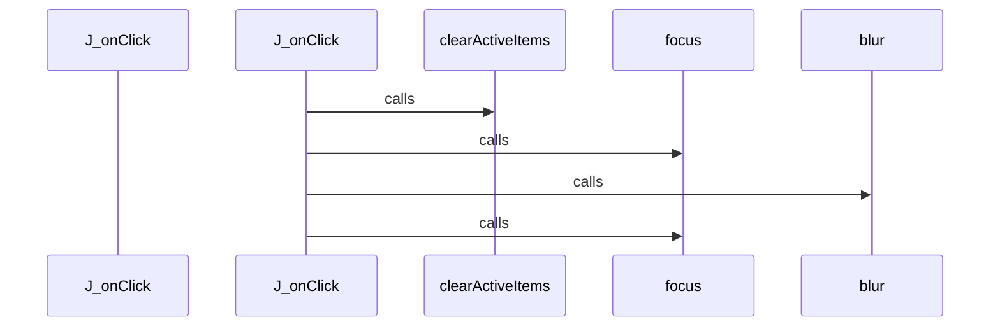

## Flow from `J.setup`

The `setup` workflow represents a critical path in the system. When this flow is triggered, execution begins in `tom-select.complete.min.js`. From there, it coordinates with 58 different components. The primary interactions involve `enable`, `removeEventListener`, and `v`.

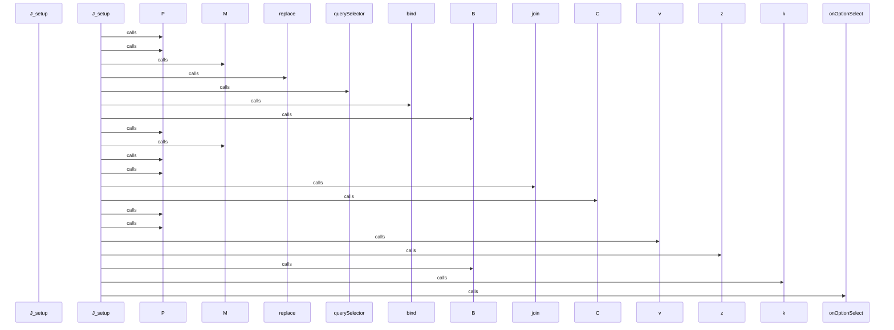

## Flow from `J.setupOptions`

The `setupOptions` workflow represents a critical path in the system. When this flow is triggered, execution begins in `tom-select.complete.min.js`. From there, it coordinates with 3 different components. The primary interactions involve `y`, `registerOptionGroup`, and `addOptions`.

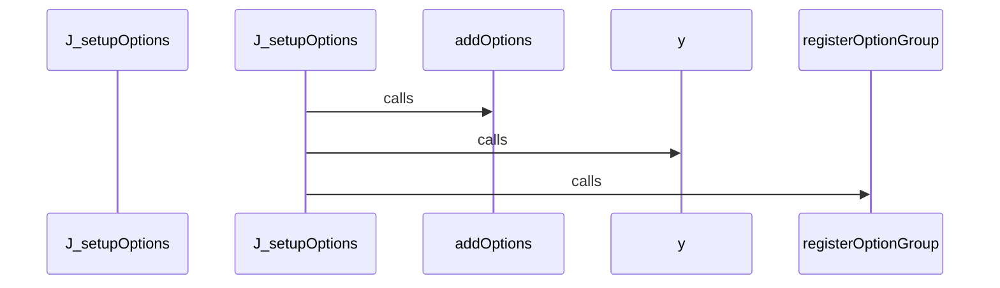

## Flow from `J.setupTemplates`

The `setupTemplates` workflow represents a critical path in the system. When this flow is triggered, execution begins in `tom-select.complete.min.js`. From there, it coordinates with 77 different components. The primary interactions involve `forEach`, `configureKeyboardBindings`, and `destroy`.

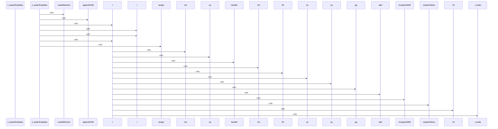

## Flow from `J.setupCallbacks`

The `setupCallbacks` workflow represents a critical path in the system. When this flow is triggered, execution begins in `tom-select.complete.min.js`. From there, it coordinates with 1 different components. The primary interactions involve `on`.

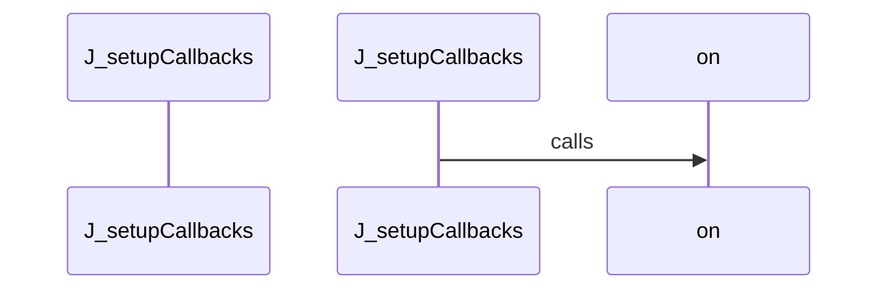

## Flow from `test_schema_setup`

The `test_schema_setup` workflow represents a critical path in the system. When this flow is triggered, execution begins in `test_manager.py`. From there, it coordinates with 5 different components. The primary interactions involve `SessionLocal`, `execute`, and `len`.

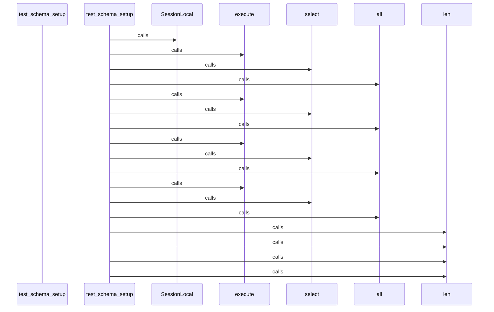

## Flow from `J.registerOption`

The `registerOption` workflow represents a critical path in the system. When this flow is triggered, execution begins in `tom-select.complete.min.js`. From there, it coordinates with 1 different components. The primary interactions involve `addOption`.

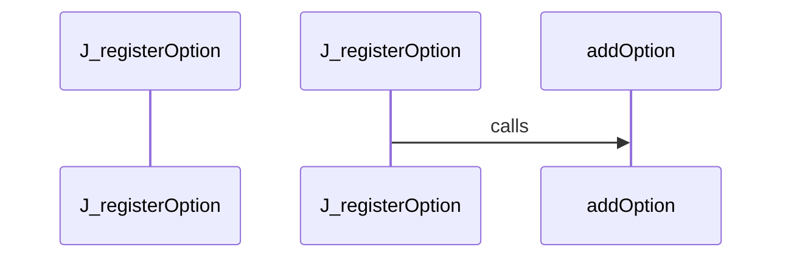

## Flow from `J.registerOptionGroup`

The `registerOptionGroup` workflow represents a critical path in the system. When this flow is triggered, execution begins in `tom-select.complete.min.js`. From there, it coordinates with 1 different components. The primary interactions involve `q`.

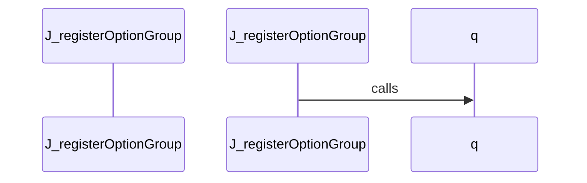

## Flow from `DBManager.ingest_project_data`

The `ingest_project_data` workflow represents a critical path in the system. When this flow is triggered, execution begins in `manager.py`. From there, it coordinates with 7 different components. The primary interactions involve `commit`, `SessionLocal`, and `execute`.

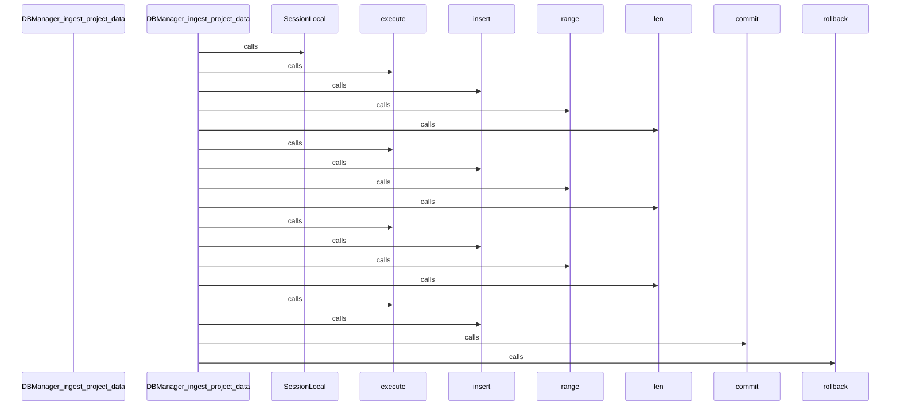

## Flow from `DocsCoordinator.generate_all`

The `generate_all` workflow represents a critical path in the system. When this flow is triggered, execution begins in `coordinator.py`. From there, it coordinates with 3 different components. The primary interactions involve `makedirs`, `_render_index`, and `generate`.

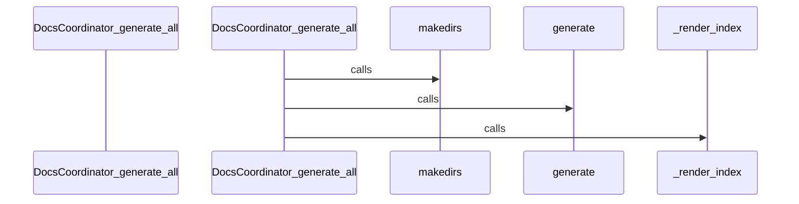

## Flow from `J.canCreate`

The `canCreate` workflow represents a critical path in the system. When this flow is triggered, execution begins in `tom-select.complete.min.js`. From there, it coordinates with 1 different components. The primary interactions involve `call`.

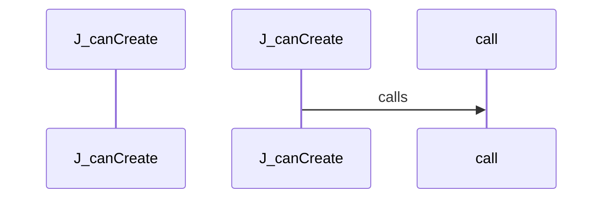

## Flow from `J.clearActiveItems`

The `clearActiveItems` workflow represents a critical path in the system. When this flow is triggered, execution begins in `tom-select.complete.min.js`. From there, it coordinates with 1 different components. The primary interactions involve `S`.

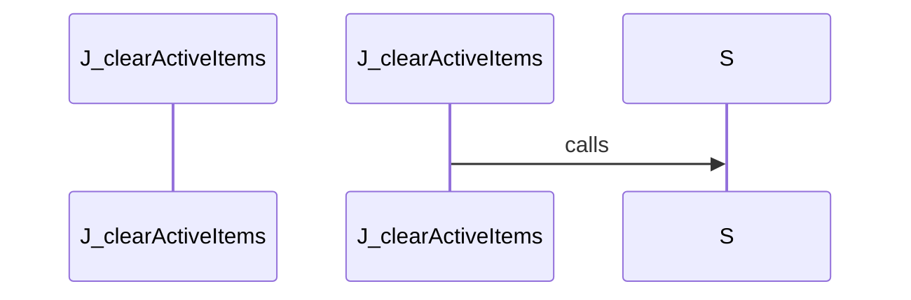

## Flow from `J.controlChildren`

The `controlChildren` workflow represents a critical path in the system. When this flow is triggered, execution begins in `tom-select.complete.min.js`. From there, it coordinates with 2 different components. The primary interactions involve `from` and `querySelectorAll`.

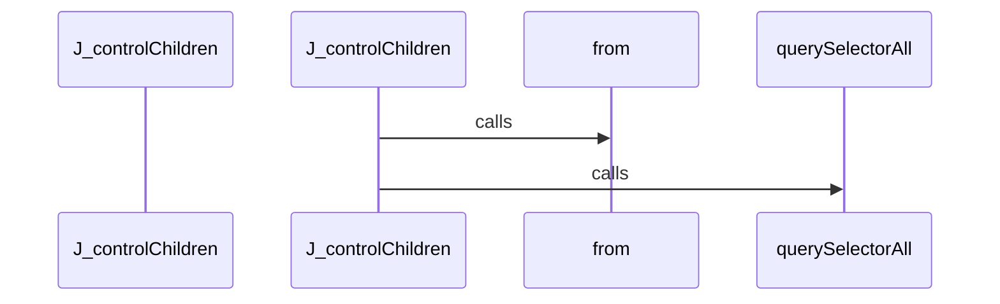

## Flow from `J.inputState`

The `inputState` workflow represents a critical path in the system. When this flow is triggered, execution begins in `tom-select.complete.min.js`. From there, it coordinates with 4 different components. The primary interactions involve `setTextboxValue`, `toggle`, and `contains`.

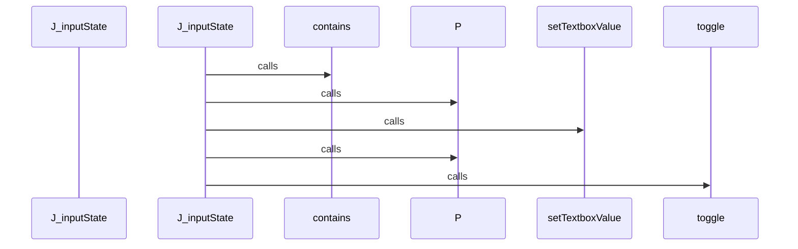

## Flow from `J.o`

The `o` workflow represents a critical path in the system. When this flow is triggered, execution begins in `tom-select.complete.min.js`. From there, it coordinates with 4 different components. The primary interactions involve `w`, `N`, and `append`.

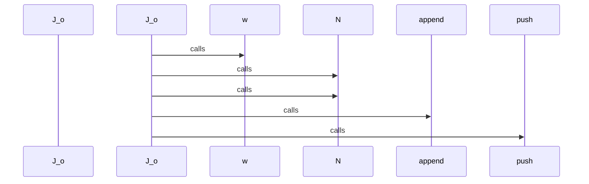

## Flow from `J.onPaste`

The `onPaste` workflow represents a critical path in the system. When this flow is triggered, execution begins in `tom-select.complete.min.js`. From there, it coordinates with 9 different components. The primary interactions involve `H`, `y`, and `inputValue`.

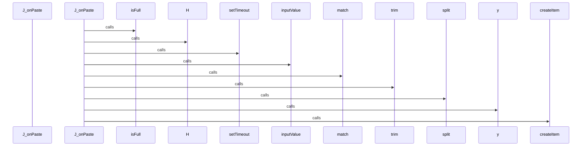

## Flow from `J.removeItem`

The `removeItem` workflow represents a critical path in the system. When this flow is triggered, execution begins in `tom-select.complete.min.js`. From there, it coordinates with 14 different components. The primary interactions involve `positionDropdown`, `hasOwnProperty`, and `L`.

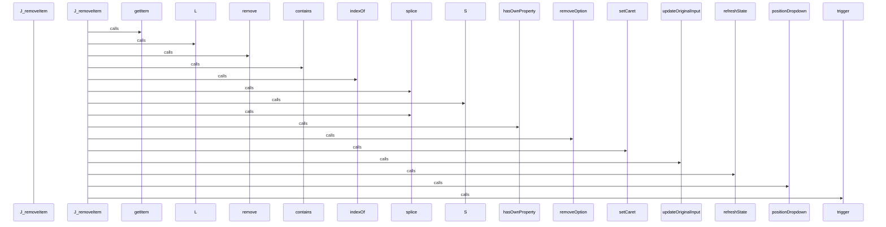

## Flow from `J.selectAll`

The `selectAll` workflow represents a critical path in the system. When this flow is triggered, execution begins in `tom-select.complete.min.js`. From there, it coordinates with 5 different components. The primary interactions involve `hideInput`, `close`, and `C`.

```mermaid
sequenceDiagram
    participant Start as J_selectAll


    J_selectAll->>controlChildren: calls


    J_selectAll->>hideInput: calls


    J_selectAll->>close: calls


    J_selectAll->>C: calls


    C->>push: calls


```

## Flow from `TestCppReturnTypes._parse`

The `_parse` workflow represents a critical path in the system. When this flow is triggered, execution begins in `test_return_types.py`. From there, it coordinates with 3 different components. The primary interactions involve `analyze_file`, `ASTParser`, and `set_language`.

```mermaid
sequenceDiagram
    participant Start as TestCppReturnTypes__parse


    TestCppReturnTypes__parse->>ASTParser: calls


    TestCppReturnTypes__parse->>set_language: calls


    TestCppReturnTypes__parse->>analyze_file: calls


```

## Flow from `b.getSortFunction`

The `getSortFunction` workflow represents a critical path in the system. When this flow is triggered, execution begins in `tom-select.complete.min.js`. From there, it coordinates with 2 different components. The primary interactions involve `_getSortFunction` and `prepareSearch`.

```mermaid
sequenceDiagram
    participant Start as b_getSortFunction


    b_getSortFunction->>prepareSearch: calls


    b_getSortFunction->>_getSortFunction: calls


```

## Flow from `test_cpp_nested_namespaces`

The `test_cpp_nested_namespaces` workflow represents a critical path in the system. When this flow is triggered, execution begins in `test_cpp.py`. From there, it coordinates with 5 different components. The primary interactions involve `dedent`, `extract_symbols`, and `ASTParser`.

```mermaid
sequenceDiagram
    participant Start as test_cpp_nested_namespaces


    test_cpp_nested_namespaces->>ASTParser: calls


    test_cpp_nested_namespaces->>set_language: calls


    test_cpp_nested_namespaces->>dedent: calls


    test_cpp_nested_namespaces->>extract_symbols: calls


    test_cpp_nested_namespaces->>len: calls


```

## Flow from `test_find_calls_by_success`

The `test_find_calls_by_success` workflow represents a critical path in the system. When this flow is triggered, execution begins in `test_query_api_references.py`. From there, it coordinates with 2 different components. The primary interactions involve `find_calls_by` and `len`.

```mermaid
sequenceDiagram
    participant Start as test_find_calls_by_success


    test_find_calls_by_success->>find_calls_by: calls


    test_find_calls_by_success->>len: calls


```

## Flow from `test_find_files_importing_success`

The `test_find_files_importing_success` workflow represents a critical path in the system. When this flow is triggered, execution begins in `test_query_api.py`. From there, it coordinates with 2 different components. The primary interactions involve `len` and `find_files_importing`.

```mermaid
sequenceDiagram
    participant Start as test_find_files_importing_success


    test_find_files_importing_success->>find_files_importing: calls


    test_find_files_importing_success->>len: calls


    test_find_files_importing_success->>find_files_importing: calls


    test_find_files_importing_success->>len: calls


```

## Flow from `test_json_safely_ignored`

The `test_json_safely_ignored` workflow represents a critical path in the system. When this flow is triggered, execution begins in `test_json.py`. From there, it coordinates with 4 different components. The primary interactions involve `extract_symbols`, `ASTParser`, and `set_language`.

```mermaid
sequenceDiagram
    participant Start as test_json_safely_ignored


    test_json_safely_ignored->>ASTParser: calls


    test_json_safely_ignored->>set_language: calls


    test_json_safely_ignored->>extract_symbols: calls


    test_json_safely_ignored->>extract_dependencies: calls


```


---
*Generated by DECODE NLG | [← Back to Index](index.md)*