# Call Flow
> **Onboarding question:** What happens during execution?


## Flow from `main`

The `main` workflow represents a critical path in the system. When this flow is triggered, execution begins in `test_main.cpp`. From there, it coordinates with 82 different components. The primary interactions involve `lstrip`, `exists`, and `connect`.

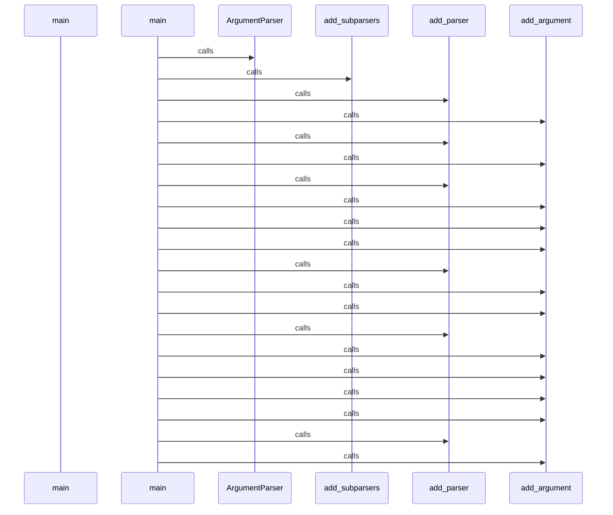

## Flow from `TestCppInheritance.test_cpp_function_calls_remain_call_kind`

The `test_cpp_function_calls_remain_call_kind` workflow represents a critical path in the system. When this flow is triggered, execution begins in `test_inheritance.py`. From there, it coordinates with 2 different components. The primary interactions involve `_parse` and `len`.

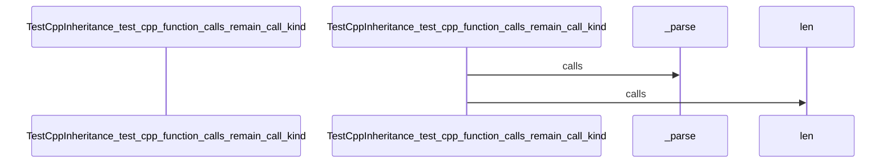

## Flow from `DBQueryAPI.get_domain_entities`

The `get_domain_entities` workflow represents a critical path in the system. When this flow is triggered, execution begins in `query_api.py`. From there, it coordinates with 11 different components. The primary interactions involve `join`, `query`, and `SessionLocal`.

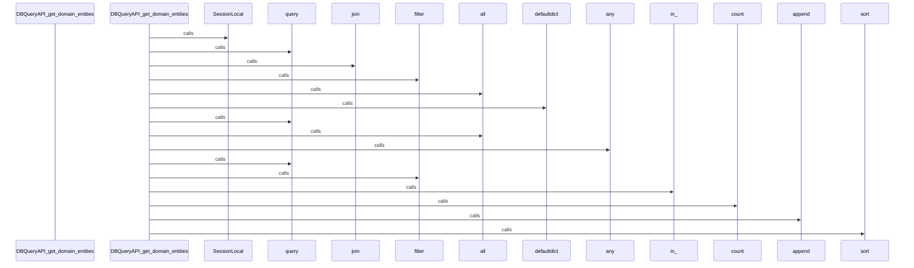

## Flow from `J.onClick`

The `onClick` workflow represents a critical path in the system. When this flow is triggered, execution begins in `tom-select.complete.min.js`. From there, it coordinates with 3 different components. The primary interactions involve `blur`, `focus`, and `clearActiveItems`.

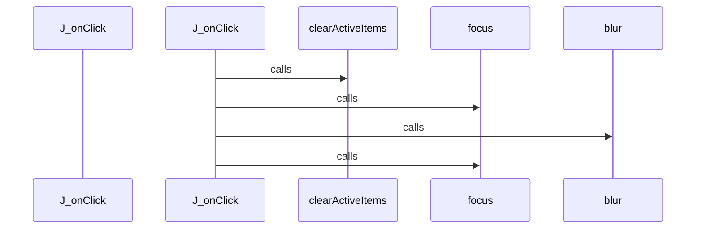

## Flow from `J.setup`

The `setup` workflow represents a critical path in the system. When this flow is triggered, execution begins in `tom-select.complete.min.js`. From there, it coordinates with 58 different components. The primary interactions involve `create`, `updateOriginalInput`, and `P`.

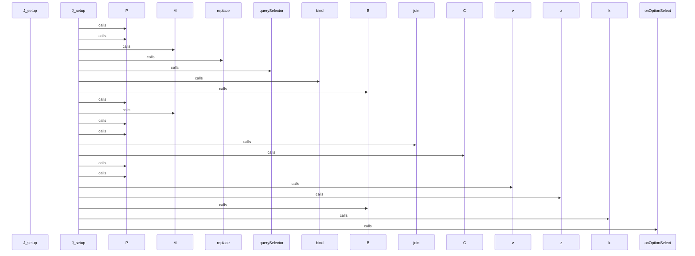

## Flow from `J.setupOptions`

The `setupOptions` workflow represents a critical path in the system. When this flow is triggered, execution begins in `tom-select.complete.min.js`. From there, it coordinates with 3 different components. The primary interactions involve `addOptions`, `y`, and `registerOptionGroup`.

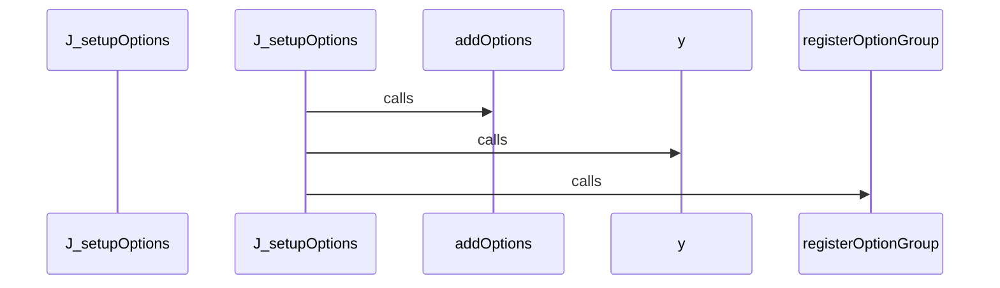

## Flow from `J.setupTemplates`

The `setupTemplates` workflow represents a critical path in the system. When this flow is triggered, execution begins in `tom-select.complete.min.js`. From there, it coordinates with 77 different components. The primary interactions involve `set`, `Kp`, and `call`.

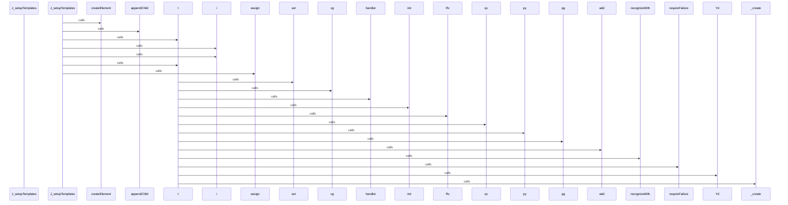

## Flow from `J.setupCallbacks`

The `setupCallbacks` workflow represents a critical path in the system. When this flow is triggered, execution begins in `tom-select.complete.min.js`. From there, it coordinates with 1 different components. The primary interactions involve `on`.

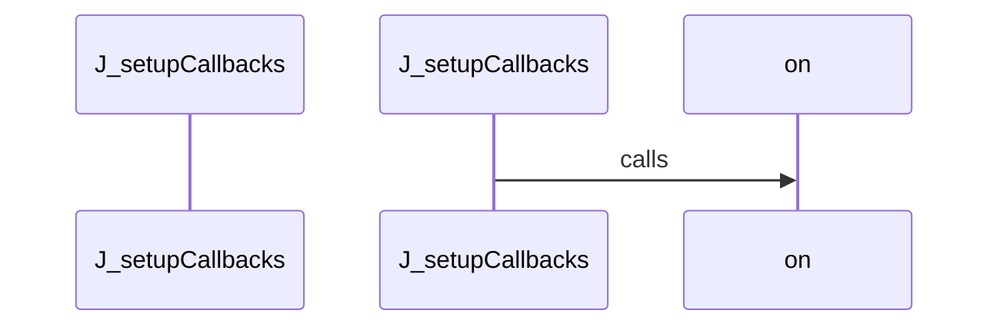

## Flow from `test_schema_setup`

The `test_schema_setup` workflow represents a critical path in the system. When this flow is triggered, execution begins in `test_manager.py`. From there, it coordinates with 5 different components. The primary interactions involve `SessionLocal`, `execute`, and `len`.

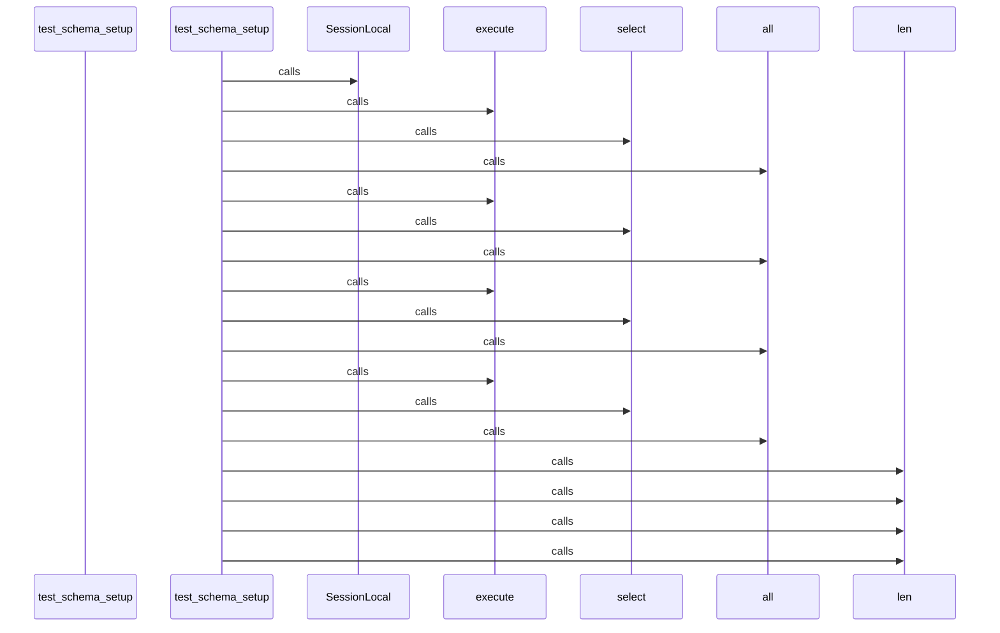

## Flow from `J.registerOption`

The `registerOption` workflow represents a critical path in the system. When this flow is triggered, execution begins in `tom-select.complete.min.js`. From there, it coordinates with 1 different components. The primary interactions involve `addOption`.

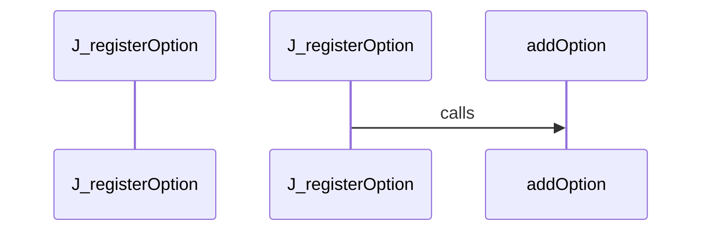

## Flow from `J.registerOptionGroup`

The `registerOptionGroup` workflow represents a critical path in the system. When this flow is triggered, execution begins in `tom-select.complete.min.js`. From there, it coordinates with 1 different components. The primary interactions involve `q`.

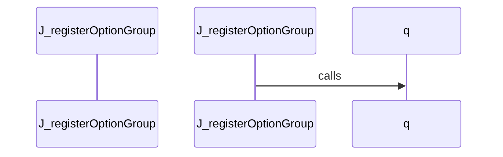

## Flow from `ArchitectureGenerator.gather_data`

The `gather_data` workflow represents a critical path in the system. When this flow is triggered, execution begins in `architecture.py`. From there, it coordinates with 2 different components. The primary interactions involve `get_module_structure` and `get_cross_module_edges`.

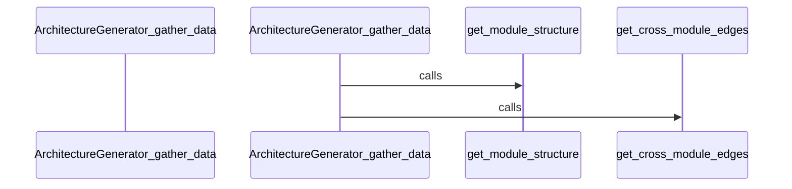

## Flow from `BaseGenerator._generate_ai_summary`

The `_generate_ai_summary` workflow represents a critical path in the system. When this flow is triggered, execution begins in `base_generator.py`. From there, it coordinates with 6 different components. The primary interactions involve `create`, `strip`, and `dumps`.

```mermaid
sequenceDiagram
    participant Start as BaseGenerator__generate_ai_summary


    BaseGenerator__generate_ai_summary->>getenv: calls


    BaseGenerator__generate_ai_summary->>print: calls


    BaseGenerator__generate_ai_summary->>getenv: calls


    BaseGenerator__generate_ai_summary->>OpenAI: calls


    BaseGenerator__generate_ai_summary->>print: calls


    BaseGenerator__generate_ai_summary->>create: calls


    BaseGenerator__generate_ai_summary->>dumps: calls


    BaseGenerator__generate_ai_summary->>strip: calls


    BaseGenerator__generate_ai_summary->>print: calls


```

## Flow from `DocsCoordinator.generate_all`

The `generate_all` workflow represents a critical path in the system. When this flow is triggered, execution begins in `coordinator.py`. From there, it coordinates with 3 different components. The primary interactions involve `generate`, `makedirs`, and `_render_index`.

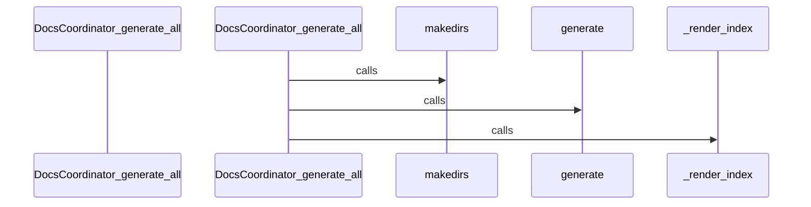

## Flow from `Ey`

The `Ey` workflow represents a critical path in the system. When this flow is triggered, execution begins in `vis-network.min.js`. From there, it coordinates with 2 different components. The primary interactions involve `create` and `qv`.

```mermaid
sequenceDiagram
    participant Start as Ey


    Ey->>create: calls


    Ey->>qv: calls


```

## Flow from `J.addOption`

The `addOption` workflow represents a critical path in the system. When this flow is triggered, execution begins in `tom-select.complete.min.js`. From there, it coordinates with 5 different components. The primary interactions involve `q`, `trigger`, and `addOptions`.

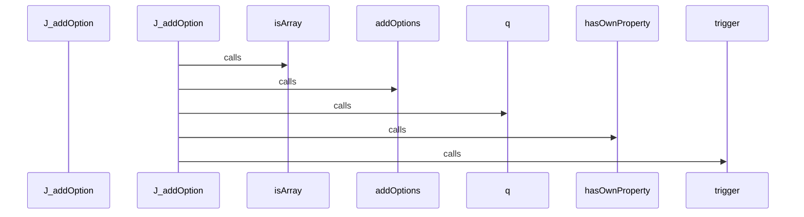

## Flow from `J.advanceSelection`

The `advanceSelection` workflow represents a critical path in the system. When this flow is triggered, execution begins in `tom-select.complete.min.js`. From there, it coordinates with 8 different components. The primary interactions involve `getLastActive`, `K`, and `setActiveItemClass`.

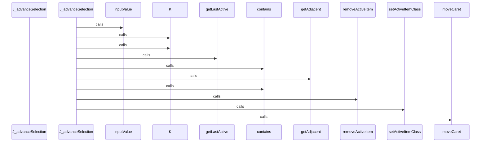

## Flow from `J.clearOptions`

The `clearOptions` workflow represents a critical path in the system. When this flow is triggered, execution begins in `tom-select.complete.min.js`. From there, it coordinates with 4 different components. The primary interactions involve `trigger`, `y`, and `clearCache`.

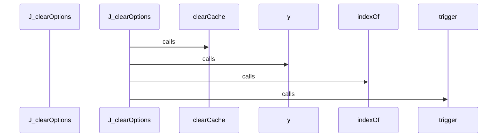

## Flow from `J.getScoreFunction`

The `getScoreFunction` workflow represents a critical path in the system. When this flow is triggered, execution begins in `tom-select.complete.min.js`. From there, it coordinates with 2 different components. The primary interactions involve `getSearchOptions` and `getScoreFunction`.

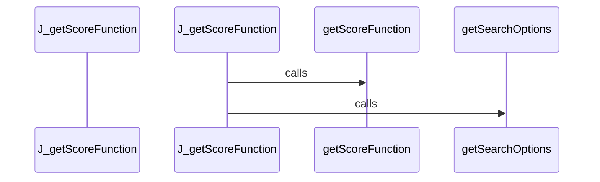

## Flow from `TestPythonInheritance.test_single_inheritance_detected`

The `test_single_inheritance_detected` workflow represents a critical path in the system. When this flow is triggered, execution begins in `test_inheritance.py`. From there, it coordinates with 3 different components. The primary interactions involve `dedent`, `_parse`, and `len`.

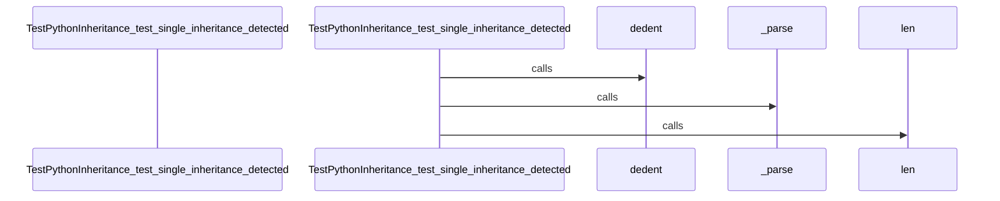

## Flow from `language_repo`

The `language_repo` workflow represents a critical path in the system. When this flow is triggered, execution begins in `test_language_detector.py`. From there, it coordinates with 2 different components. The primary interactions involve `write_text` and `str`.

```mermaid
sequenceDiagram
    participant Start as language_repo


    language_repo->>write_text: calls


    language_repo->>write_text: calls


    language_repo->>write_text: calls


    language_repo->>write_text: calls


    language_repo->>write_text: calls


    language_repo->>write_text: calls


    language_repo->>str: calls


    language_repo->>str: calls


    language_repo->>str: calls


    language_repo->>str: calls


    language_repo->>str: calls


    language_repo->>str: calls


```

## Flow from `test_find_symbol_missing`

The `test_find_symbol_missing` workflow represents a critical path in the system. When this flow is triggered, execution begins in `test_query_api.py`. From there, it coordinates with 3 different components. The primary interactions involve `find_symbol`, `isinstance`, and `len`.

```mermaid
sequenceDiagram
    participant Start as test_find_symbol_missing


    test_find_symbol_missing->>find_symbol: calls


    test_find_symbol_missing->>isinstance: calls


    test_find_symbol_missing->>len: calls


```

## Flow from `test_get_existing_files`

The `test_get_existing_files` workflow represents a critical path in the system. When this flow is triggered, execution begins in `test_manager.py`. From there, it coordinates with 3 different components. The primary interactions involve `len`, `isinstance`, and `get_existing_files`.

```mermaid
sequenceDiagram
    participant Start as test_get_existing_files


    test_get_existing_files->>get_existing_files: calls


    test_get_existing_files->>isinstance: calls


    test_get_existing_files->>len: calls


```

## Flow from `test_language_detection`

The `test_language_detection` workflow represents a critical path in the system. When this flow is triggered, execution begins in `test_language_detector.py`. From there, it coordinates with 1 different components. The primary interactions involve `detect_language`.

```mermaid
sequenceDiagram
    participant Start as test_language_detection


    test_language_detection->>detect_language: calls


    test_language_detection->>detect_language: calls


    test_language_detection->>detect_language: calls


    test_language_detection->>detect_language: calls


    test_language_detection->>detect_language: calls


    test_language_detection->>detect_language: calls


```

## Flow from `test_python_garbage_safety`

The `test_python_garbage_safety` workflow represents a critical path in the system. When this flow is triggered, execution begins in `test_ast_parser.py`. From there, it coordinates with 6 different components. The primary interactions involve `isinstance`, `dedent`, and `ASTParser`.

```mermaid
sequenceDiagram
    participant Start as test_python_garbage_safety


    test_python_garbage_safety->>ASTParser: calls


    test_python_garbage_safety->>set_language: calls


    test_python_garbage_safety->>dedent: calls


    test_python_garbage_safety->>extract_symbols: calls


    test_python_garbage_safety->>extract_dependencies: calls


    test_python_garbage_safety->>isinstance: calls


    test_python_garbage_safety->>isinstance: calls


```

## Flow from `test_walker_nonexistent_directory`

The `test_walker_nonexistent_directory` workflow represents a critical path in the system. When this flow is triggered, execution begins in `test_fs_walker.py`. From there, it coordinates with 2 different components. The primary interactions involve `walk_repository` and `len`.

```mermaid
sequenceDiagram
    participant Start as test_walker_nonexistent_directory


    test_walker_nonexistent_directory->>walk_repository: calls


    test_walker_nonexistent_directory->>len: calls


```


---
*Generated by DECODE NLG | [← Back to Index](index.md)*