# Call Flow
> **Onboarding question:** What happens during execution?


## Flow from `main`

The `main` workflow represents a critical path in the system. When this flow is triggered, execution begins in `test_main.cpp`. From there, it coordinates with 82 different components. The primary interactions involve `connect`, `FileSystemLoader`, and `execute`.

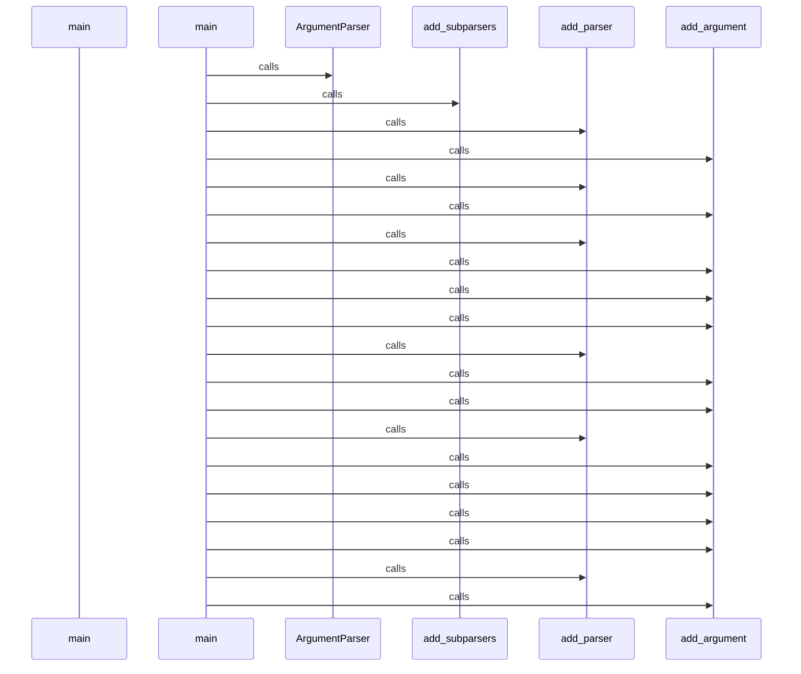

## Flow from `TestCppInheritance.test_cpp_function_calls_remain_call_kind`

The `test_cpp_function_calls_remain_call_kind` workflow represents a critical path in the system. When this flow is triggered, execution begins in `test_inheritance.py`. From there, it coordinates with 2 different components. The primary interactions involve `_parse` and `len`.

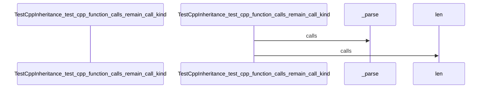

## Flow from `DBQueryAPI.get_domain_entities`

The `get_domain_entities` workflow represents a critical path in the system. When this flow is triggered, execution begins in `query_api.py`. From there, it coordinates with 11 different components. The primary interactions involve `filter`, `query`, and `count`.

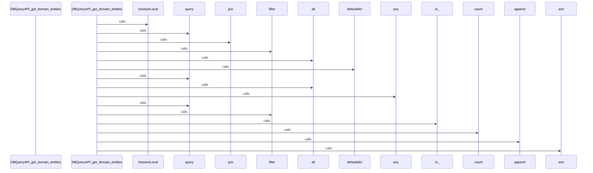

## Flow from `J.onClick`

The `onClick` workflow represents a critical path in the system. When this flow is triggered, execution begins in `tom-select.complete.min.js`. From there, it coordinates with 3 different components. The primary interactions involve `clearActiveItems`, `blur`, and `focus`.

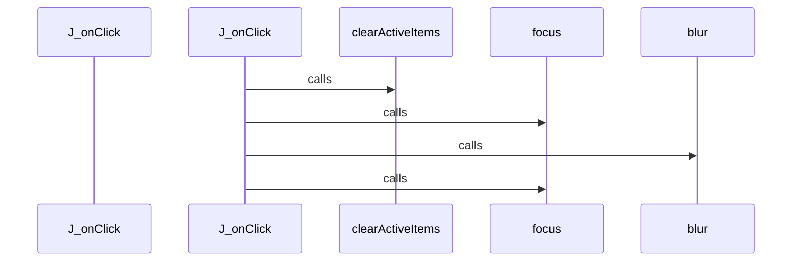

## Flow from `J.setup`

The `setup` workflow represents a critical path in the system. When this flow is triggered, execution begins in `tom-select.complete.min.js`. From there, it coordinates with 58 different components. The primary interactions involve `close`, `M`, and `h`.

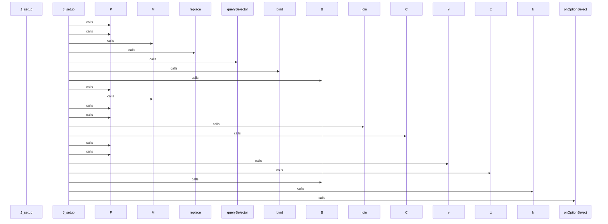

## Flow from `J.setupOptions`

The `setupOptions` workflow represents a critical path in the system. When this flow is triggered, execution begins in `tom-select.complete.min.js`. From there, it coordinates with 3 different components. The primary interactions involve `registerOptionGroup`, `addOptions`, and `y`.

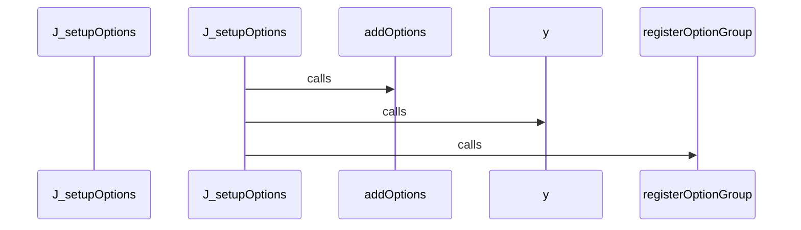

## Flow from `J.setupTemplates`

The `setupTemplates` workflow represents a critical path in the system. When this flow is triggered, execution begins in `tom-select.complete.min.js`. From there, it coordinates with 77 different components. The primary interactions involve `setImages`, `py`, and `Kv`.

```mermaid
sequenceDiagram
    participant Start as J_setupTemplates


    J_setupTemplates->>createElement: calls


    J_setupTemplates->>appendChild: calls


    J_setupTemplates->>t: calls


    J_setupTemplates->>i: calls


    J_setupTemplates->>i: calls


    J_setupTemplates->>t: calls


    J_setupTemplates->>assign: calls


    i->>off: calls


    i->>apply: calls


    i->>d: calls


    i->>call: calls


    i->>resolve: calls


    i->>then: calls


    i->>i: calls


    i->>i: calls


    i->>resolve: calls


    i->>then: calls


    i->>s: calls


    i->>i: calls


    i->>a: calls


```

## Flow from `J.setupCallbacks`

The `setupCallbacks` workflow represents a critical path in the system. When this flow is triggered, execution begins in `tom-select.complete.min.js`. From there, it coordinates with 1 different components. The primary interactions involve `on`.

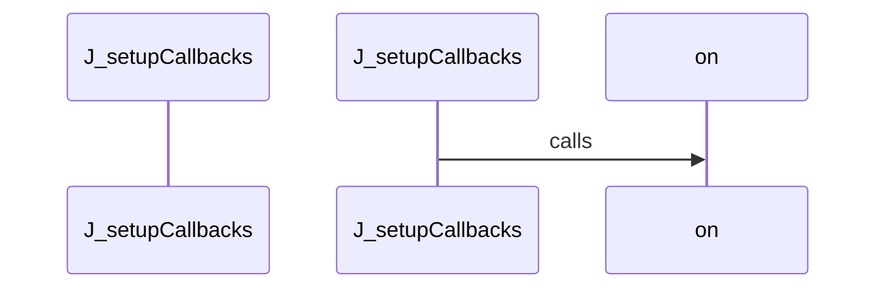

## Flow from `test_schema_setup`

The `test_schema_setup` workflow represents a critical path in the system. When this flow is triggered, execution begins in `test_manager.py`. From there, it coordinates with 5 different components. The primary interactions involve `execute`, `select`, and `SessionLocal`.

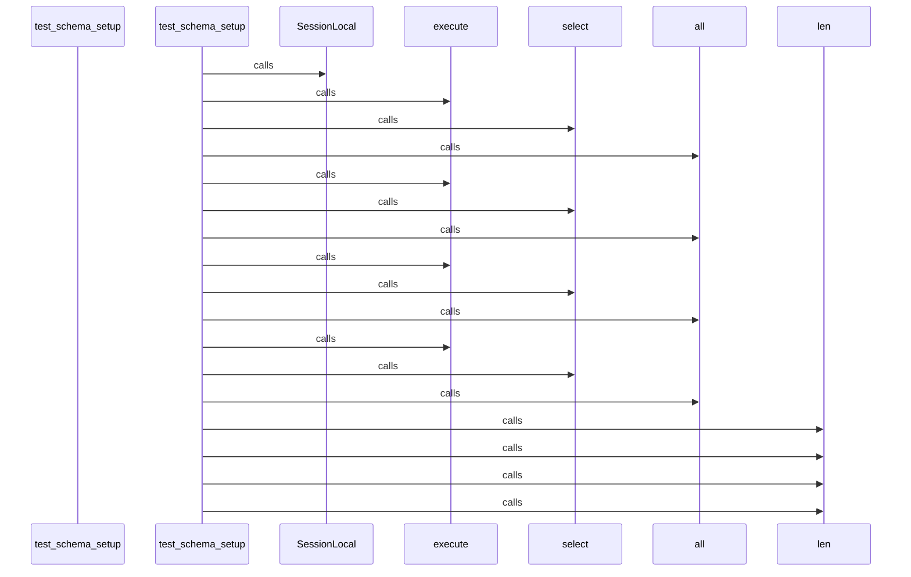

## Flow from `J.registerOption`

The `registerOption` workflow represents a critical path in the system. When this flow is triggered, execution begins in `tom-select.complete.min.js`. From there, it coordinates with 1 different components. The primary interactions involve `addOption`.

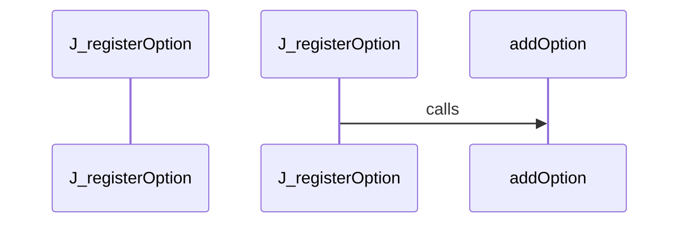

## Flow from `J.registerOptionGroup`

The `registerOptionGroup` workflow represents a critical path in the system. When this flow is triggered, execution begins in `tom-select.complete.min.js`. From there, it coordinates with 1 different components. The primary interactions involve `q`.

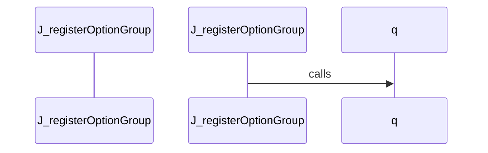

## Flow from `ArchitectureGenerator.gather_data`

The `gather_data` workflow represents a critical path in the system. When this flow is triggered, execution begins in `architecture.py`. From there, it coordinates with 2 different components. The primary interactions involve `get_module_structure` and `get_cross_module_edges`.

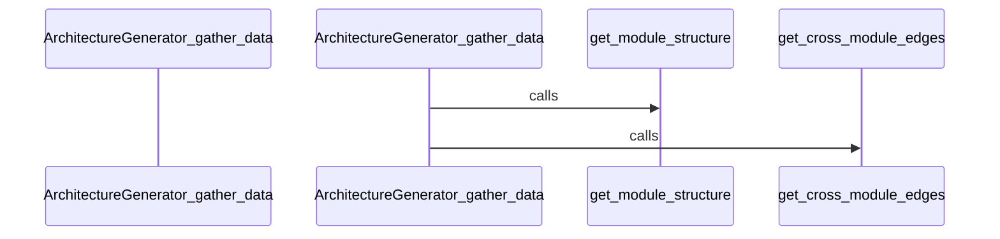

## Flow from `DBManager.remove_stale_files`

The `remove_stale_files` workflow represents a critical path in the system. When this flow is triggered, execution begins in `manager.py`. From there, it coordinates with 9 different components. The primary interactions involve `range`, `in_`, and `rollback`.

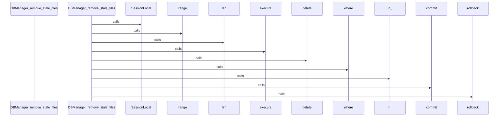

## Flow from `DBQueryAPI.find_callers_of`

The `find_callers_of` workflow represents a critical path in the system. When this flow is triggered, execution begins in `query_api.py`. From there, it coordinates with 6 different components. The primary interactions involve `select`, `execute`, and `SessionLocal`.

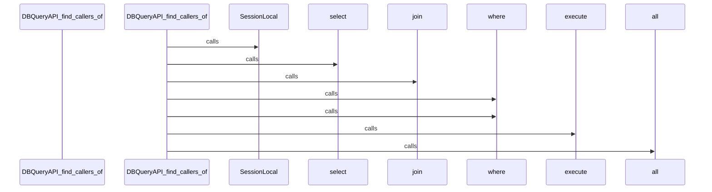

## Flow from `DBQueryAPI.get_class_hierarchy`

The `get_class_hierarchy` workflow represents a critical path in the system. When this flow is triggered, execution begins in `query_api.py`. From there, it coordinates with 6 different components. The primary interactions involve `select`, `execute`, and `SessionLocal`.

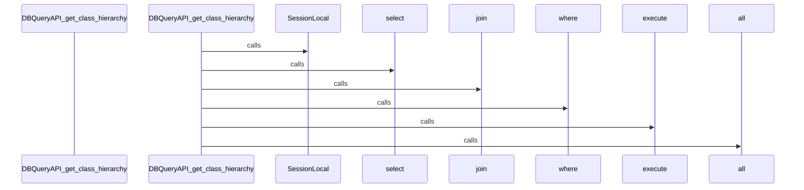

## Flow from `DBQueryAPI.get_module_structure`

The `get_module_structure` workflow represents a critical path in the system. When this flow is triggered, execution begins in `query_api.py`. From there, it coordinates with 13 different components. The primary interactions involve `split`, `set`, and `query`.

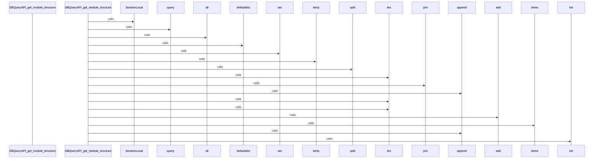

## Flow from `J.addOption`

The `addOption` workflow represents a critical path in the system. When this flow is triggered, execution begins in `tom-select.complete.min.js`. From there, it coordinates with 5 different components. The primary interactions involve `hasOwnProperty`, `isArray`, and `addOptions`.

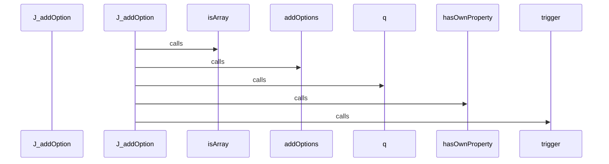

## Flow from `J.enable`

The `enable` workflow represents a critical path in the system. When this flow is triggered, execution begins in `tom-select.complete.min.js`. From there, it coordinates with 1 different components. The primary interactions involve `unlock`.

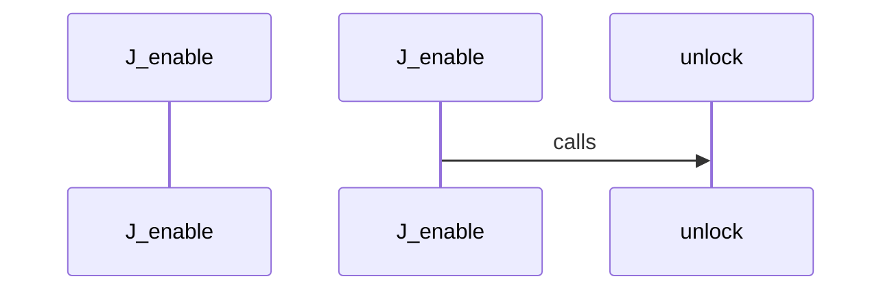

## Flow from `J.hook`

The `hook` workflow represents a critical path in the system. When this flow is triggered, execution begins in `tom-select.complete.min.js`. From there, it coordinates with 1 different components. The primary interactions involve `apply`.

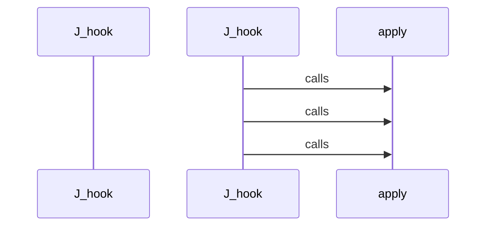

## Flow from `J.insertAtCaret`

The `insertAtCaret` workflow represents a critical path in the system. When this flow is triggered, execution begins in `tom-select.complete.min.js`. From there, it coordinates with 2 different components. The primary interactions involve `setCaret` and `insertBefore`.

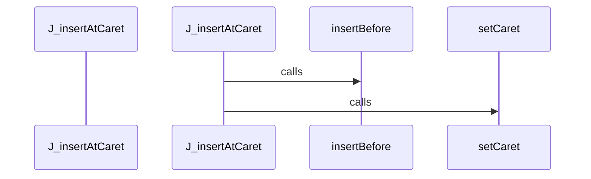

## Flow from `J.onBlur`

The `onBlur` workflow represents a critical path in the system. When this flow is triggered, execution begins in `tom-select.complete.min.js`. From there, it coordinates with 35 different components. The primary interactions involve `setImages`, `setOptions`, and `createItem`.

```mermaid
sequenceDiagram
    participant Start as J_onBlur


    J_onBlur->>hasFocus: calls


    J_onBlur->>close: calls


    J_onBlur->>setActiveItem: calls


    J_onBlur->>setCaret: calls


    J_onBlur->>trigger: calls


    J_onBlur->>createItem: calls


    J_onBlur->>i: calls


    i->>off: calls


    i->>apply: calls


    i->>d: calls


    i->>call: calls


    i->>resolve: calls


    i->>then: calls


    i->>i: calls


    i->>i: calls


    i->>resolve: calls


    i->>then: calls


    i->>s: calls


    i->>i: calls


    i->>a: calls


```

## Flow from `J.render`

The `render` workflow represents a critical path in the system. When this flow is triggered, execution begins in `tom-select.complete.min.js`. From there, it coordinates with 1 different components. The primary interactions involve `_render`.

```mermaid
sequenceDiagram
    participant Start as J_render


    J_render->>_render: calls


```

## Flow from `TestCppInheritance.test_inheritance_caller_is_child_class`

The `test_inheritance_caller_is_child_class` workflow represents a critical path in the system. When this flow is triggered, execution begins in `test_inheritance.py`. From there, it coordinates with 3 different components. The primary interactions involve `_parse`, `any`, and `dedent`.

```mermaid
sequenceDiagram
    participant Start as TestCppInheritance_test_inheritance_caller_is_child_class


    TestCppInheritance_test_inheritance_caller_is_child_class->>dedent: calls


    TestCppInheritance_test_inheritance_caller_is_child_class->>_parse: calls


    TestCppInheritance_test_inheritance_caller_is_child_class->>any: calls


```

## Flow from `selectNode`

The `selectNode` workflow represents a critical path in the system. When this flow is triggered, execution begins in `utils.js`. From there, it coordinates with 9 different components. The primary interactions involve `concat`, `selectNodes`, and `neighbourhoodHighlight`.

```mermaid
sequenceDiagram
    participant Start as selectNode


    selectNode->>selectNodes: calls


    selectNode->>neighbourhoodHighlight: calls


    neighbourhoodHighlight->>get: calls


    neighbourhoodHighlight->>getConnectedNodes: calls


    neighbourhoodHighlight->>concat: calls


    neighbourhoodHighlight->>getConnectedNodes: calls


    neighbourhoodHighlight->>hasOwnProperty: calls


    neighbourhoodHighlight->>push: calls


    neighbourhoodHighlight->>update: calls


    neighbourhoodHighlight->>hasOwnProperty: calls


    neighbourhoodHighlight->>push: calls


    neighbourhoodHighlight->>update: calls


    selectNodes->>selectNodes: calls


    selectNodes->>filterHighlight: calls


    filterHighlight->>get: calls


    filterHighlight->>hasOwnProperty: calls


    filterHighlight->>push: calls


    filterHighlight->>update: calls


    filterHighlight->>hasOwnProperty: calls


    filterHighlight->>push: calls


```

## Flow from `test_go_basic_symbols`

The `test_go_basic_symbols` workflow represents a critical path in the system. When this flow is triggered, execution begins in `test_go.py`. From there, it coordinates with 5 different components. The primary interactions involve `set_language`, `ASTParser`, and `dedent`.

```mermaid
sequenceDiagram
    participant Start as test_go_basic_symbols


    test_go_basic_symbols->>ASTParser: calls


    test_go_basic_symbols->>set_language: calls


    test_go_basic_symbols->>dedent: calls


    test_go_basic_symbols->>extract_symbols: calls


    test_go_basic_symbols->>len: calls


```

## Flow from `test_go_garbage_safety`

The `test_go_garbage_safety` workflow represents a critical path in the system. When this flow is triggered, execution begins in `test_go.py`. From there, it coordinates with 4 different components. The primary interactions involve `extract_dependencies`, `set_language`, and `ASTParser`.

```mermaid
sequenceDiagram
    participant Start as test_go_garbage_safety


    test_go_garbage_safety->>ASTParser: calls


    test_go_garbage_safety->>set_language: calls


    test_go_garbage_safety->>extract_dependencies: calls


    test_go_garbage_safety->>isinstance: calls


```

## Flow from `test_language_detection`

The `test_language_detection` workflow represents a critical path in the system. When this flow is triggered, execution begins in `test_language_detector.py`. From there, it coordinates with 1 different components. The primary interactions involve `detect_language`.

```mermaid
sequenceDiagram
    participant Start as test_language_detection


    test_language_detection->>detect_language: calls


    test_language_detection->>detect_language: calls


    test_language_detection->>detect_language: calls


    test_language_detection->>detect_language: calls


    test_language_detection->>detect_language: calls


    test_language_detection->>detect_language: calls


```

## Flow from `test_python_garbage_safety`

The `test_python_garbage_safety` workflow represents a critical path in the system. When this flow is triggered, execution begins in `test_ast_parser.py`. From there, it coordinates with 6 different components. The primary interactions involve `extract_dependencies`, `set_language`, and `ASTParser`.

```mermaid
sequenceDiagram
    participant Start as test_python_garbage_safety


    test_python_garbage_safety->>ASTParser: calls


    test_python_garbage_safety->>set_language: calls


    test_python_garbage_safety->>dedent: calls


    test_python_garbage_safety->>extract_symbols: calls


    test_python_garbage_safety->>extract_dependencies: calls


    test_python_garbage_safety->>isinstance: calls


    test_python_garbage_safety->>isinstance: calls


```


---
*Generated by DECODE NLG | [← Back to Index](index.md)*