# Call Flow
> **Onboarding question:** What happens during execution?


## Flow from `main`

The `main` workflow represents a critical path in the system. When this flow is triggered, execution begins in `test_main.cpp`. From there, it coordinates with 82 different components. The primary interactions involve `Network`, `first`, and `in_`.

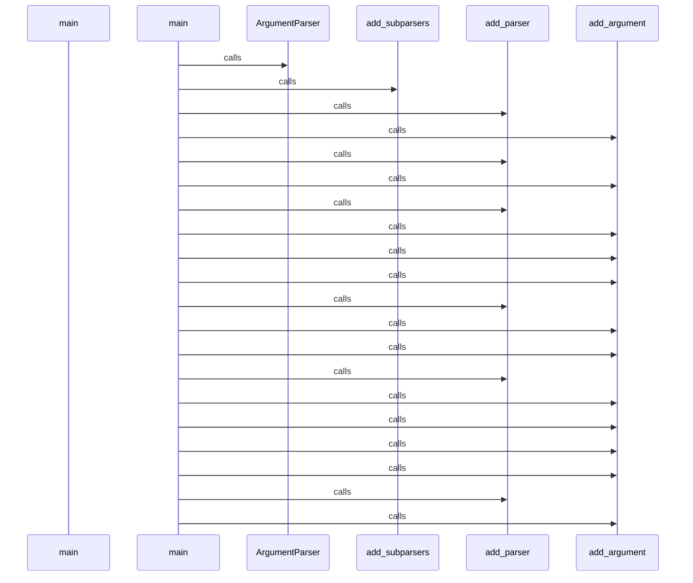

## Flow from `TestCppInheritance.test_cpp_function_calls_remain_call_kind`

The `test_cpp_function_calls_remain_call_kind` workflow represents a critical path in the system. When this flow is triggered, execution begins in `test_inheritance.py`. From there, it coordinates with 2 different components. The primary interactions involve `len` and `_parse`.

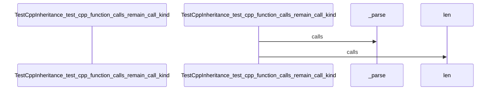

## Flow from `DBQueryAPI.get_domain_entities`

The `get_domain_entities` workflow represents a critical path in the system. When this flow is triggered, execution begins in `query_api.py`. From there, it coordinates with 11 different components. The primary interactions involve `any`, `SessionLocal`, and `join`.

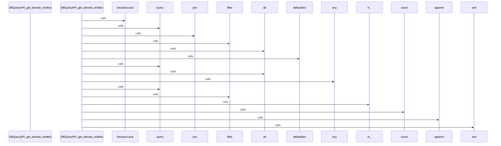

## Flow from `J.onClick`

The `onClick` workflow represents a critical path in the system. When this flow is triggered, execution begins in `tom-select.complete.min.js`. From there, it coordinates with 3 different components. The primary interactions involve `clearActiveItems`, `focus`, and `blur`.

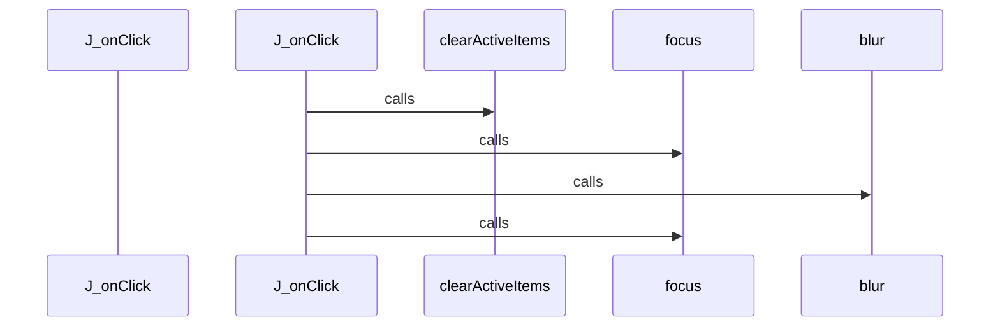

## Flow from `J.setup`

The `setup` workflow represents a critical path in the system. When this flow is triggered, execution begins in `tom-select.complete.min.js`. From there, it coordinates with 58 different components. The primary interactions involve `preload`, `onFocus`, and `stopPropagation`.

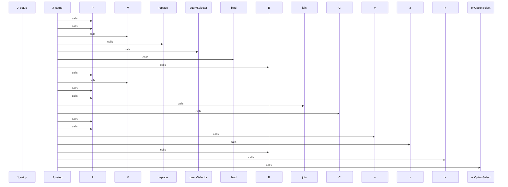

## Flow from `J.setupOptions`

The `setupOptions` workflow represents a critical path in the system. When this flow is triggered, execution begins in `tom-select.complete.min.js`. From there, it coordinates with 3 different components. The primary interactions involve `registerOptionGroup`, `y`, and `addOptions`.

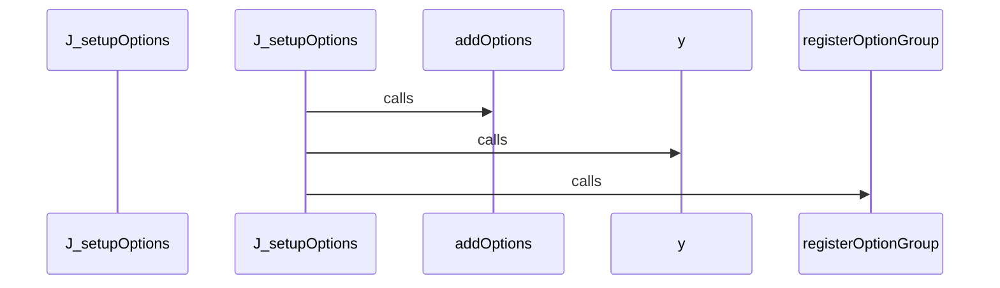

## Flow from `J.setupTemplates`

The `setupTemplates` workflow represents a critical path in the system. When this flow is triggered, execution begins in `tom-select.complete.min.js`. From there, it coordinates with 77 different components. The primary interactions involve `assign`, `Hv`, and `Yd`.

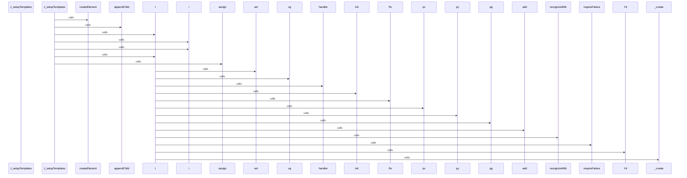

## Flow from `J.setupCallbacks`

The `setupCallbacks` workflow represents a critical path in the system. When this flow is triggered, execution begins in `tom-select.complete.min.js`. From there, it coordinates with 1 different components. The primary interactions involve `on`.

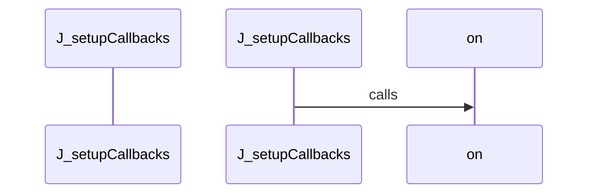

## Flow from `test_schema_setup`

The `test_schema_setup` workflow represents a critical path in the system. When this flow is triggered, execution begins in `test_manager.py`. From there, it coordinates with 5 different components. The primary interactions involve `len`, `select`, and `SessionLocal`.

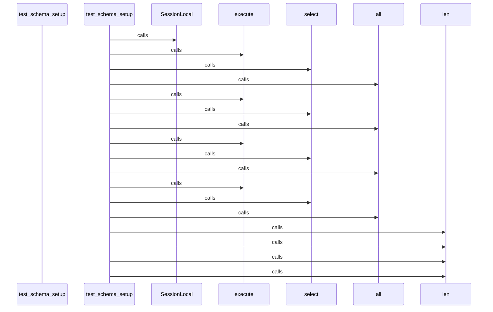

## Flow from `J.registerOption`

The `registerOption` workflow represents a critical path in the system. When this flow is triggered, execution begins in `tom-select.complete.min.js`. From there, it coordinates with 1 different components. The primary interactions involve `addOption`.

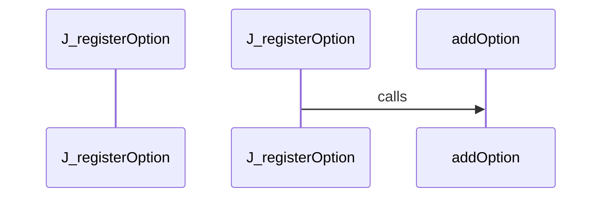

## Flow from `J.registerOptionGroup`

The `registerOptionGroup` workflow represents a critical path in the system. When this flow is triggered, execution begins in `tom-select.complete.min.js`. From there, it coordinates with 1 different components. The primary interactions involve `q`.

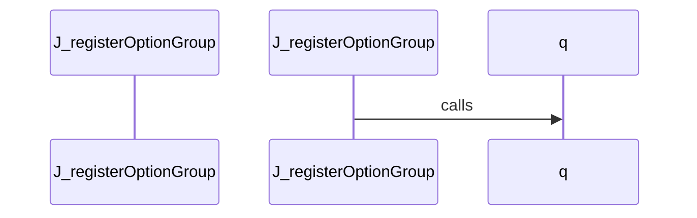

## Flow from `DBManager.ingest_project_data`

The `ingest_project_data` workflow represents a critical path in the system. When this flow is triggered, execution begins in `manager.py`. From there, it coordinates with 7 different components. The primary interactions involve `len`, `SessionLocal`, and `execute`.

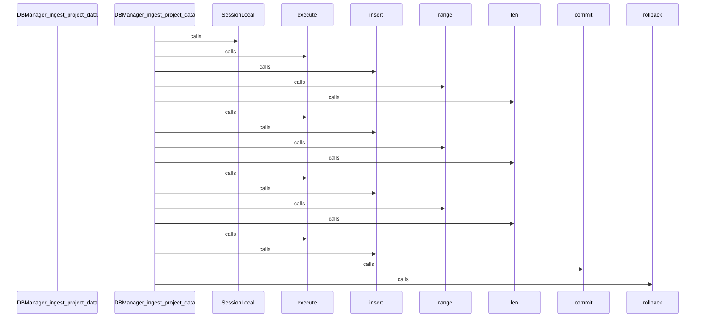

## Flow from `DBQueryAPI.find_files_importing`

The `find_files_importing` workflow represents a critical path in the system. When this flow is triggered, execution begins in `query_api.py`. From there, it coordinates with 7 different components. The primary interactions involve `select`, `where`, and `SessionLocal`.

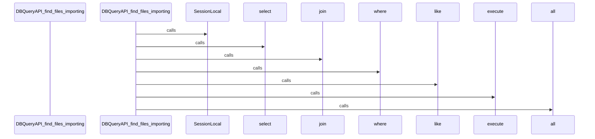

## Flow from `DBQueryAPI.get_class_hierarchy`

The `get_class_hierarchy` workflow represents a critical path in the system. When this flow is triggered, execution begins in `query_api.py`. From there, it coordinates with 6 different components. The primary interactions involve `select`, `where`, and `SessionLocal`.

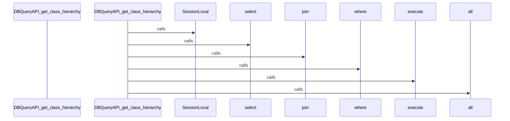

## Flow from `J.addOptionGroup`

The `addOptionGroup` workflow represents a critical path in the system. When this flow is triggered, execution begins in `tom-select.complete.min.js`. From there, it coordinates with 2 different components. The primary interactions involve `registerOptionGroup` and `trigger`.

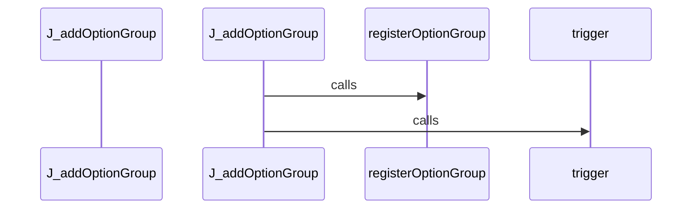

## Flow from `J.clearActiveItems`

The `clearActiveItems` workflow represents a critical path in the system. When this flow is triggered, execution begins in `tom-select.complete.min.js`. From there, it coordinates with 1 different components. The primary interactions involve `S`.

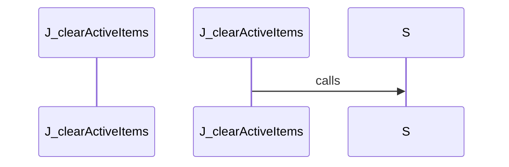

## Flow from `J.clearOptions`

The `clearOptions` workflow represents a critical path in the system. When this flow is triggered, execution begins in `tom-select.complete.min.js`. From there, it coordinates with 4 different components. The primary interactions involve `clearCache`, `y`, and `trigger`.

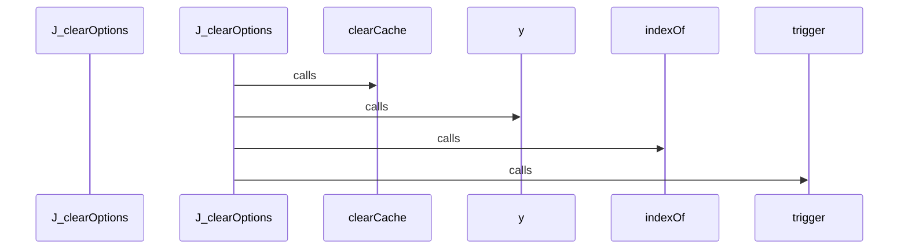

## Flow from `J.destroy`

The `destroy` workflow represents a critical path in the system. When this flow is triggered, execution begins in `tom-select.complete.min.js`. From there, it coordinates with 5 different components. The primary interactions involve `trigger`, `_destroy`, and `off`.

```mermaid
sequenceDiagram
    participant Start as J_destroy


    J_destroy->>trigger: calls


    J_destroy->>off: calls


    J_destroy->>remove: calls


    J_destroy->>remove: calls


    J_destroy->>S: calls


    J_destroy->>_destroy: calls


```

## Flow from `J.onInput`

The `onInput` workflow represents a critical path in the system. When this flow is triggered, execution begins in `tom-select.complete.min.js`. From there, it coordinates with 5 different components. The primary interactions involve `trigger`, `load`, and `refreshOptions`.

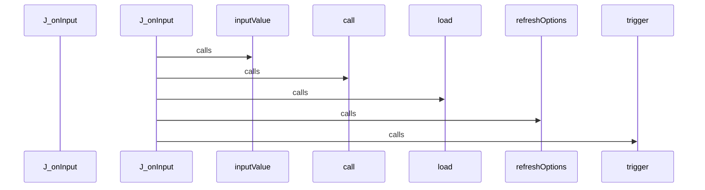

## Flow from `J.selectable`

The `selectable` workflow represents a critical path in the system. When this flow is triggered, execution begins in `tom-select.complete.min.js`. From there, it coordinates with 1 different components. The primary interactions involve `querySelectorAll`.

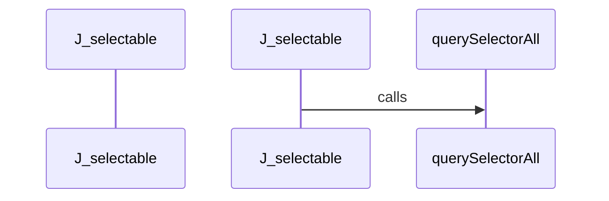

## Flow from `J.setActiveItemClass`

The `setActiveItemClass` workflow represents a critical path in the system. When this flow is triggered, execution begins in `tom-select.complete.min.js`. From there, it coordinates with 6 different components. The primary interactions involve `trigger`, `push`, and `querySelector`.

```mermaid
sequenceDiagram
    participant Start as J_setActiveItemClass


    J_setActiveItemClass->>querySelector: calls


    J_setActiveItemClass->>S: calls


    J_setActiveItemClass->>C: calls


    J_setActiveItemClass->>trigger: calls


    J_setActiveItemClass->>indexOf: calls


    J_setActiveItemClass->>push: calls


    C->>push: calls


```

## Flow from `J.uncacheValue`

The `uncacheValue` workflow represents a critical path in the system. When this flow is triggered, execution begins in `tom-select.complete.min.js`. From there, it coordinates with 2 different components. The primary interactions involve `remove` and `getOption`.

```mermaid
sequenceDiagram
    participant Start as J_uncacheValue


    J_uncacheValue->>getOption: calls


    J_uncacheValue->>remove: calls


```

## Flow from `TestCppReturnTypes.test_bool_return_type`

The `test_bool_return_type` workflow represents a critical path in the system. When this flow is triggered, execution begins in `test_return_types.py`. From there, it coordinates with 1 different components. The primary interactions involve `_parse`.

```mermaid
sequenceDiagram
    participant Start as TestCppReturnTypes_test_bool_return_type


    TestCppReturnTypes_test_bool_return_type->>_parse: calls


```

## Flow from `qg`

The `qg` workflow represents a critical path in the system. When this flow is triggered, execution begins in `vis-network.min.js`. From there, it coordinates with 10 different components. The primary interactions involve `mg`, `jg`, and `push`.

```mermaid
sequenceDiagram
    participant Start as qg


    qg->>jg: calls


    qg->>jg: calls


    qg->>filter: calls


    qg->>mg: calls


    qg->>push: calls


    qg->>Rg: calls


    qg->>concat: calls


    jg->>call: calls


    Rg->>Ig: calls


    Rg->>push: calls


    Rg->>sort: calls


    Rg->>sort: calls


    Ig->>indexOf: calls


```

## Flow from `test_bash_basic_symbols`

The `test_bash_basic_symbols` workflow represents a critical path in the system. When this flow is triggered, execution begins in `test_bash.py`. From there, it coordinates with 5 different components. The primary interactions involve `len`, `ASTParser`, and `dedent`.

```mermaid
sequenceDiagram
    participant Start as test_bash_basic_symbols


    test_bash_basic_symbols->>ASTParser: calls


    test_bash_basic_symbols->>set_language: calls


    test_bash_basic_symbols->>dedent: calls


    test_bash_basic_symbols->>extract_symbols: calls


    test_bash_basic_symbols->>len: calls


```

## Flow from `test_get_class_hierarchy_success`

The `test_get_class_hierarchy_success` workflow represents a critical path in the system. When this flow is triggered, execution begins in `test_query_api_references.py`. From there, it coordinates with 2 different components. The primary interactions involve `len` and `get_class_hierarchy`.

```mermaid
sequenceDiagram
    participant Start as test_get_class_hierarchy_success


    test_get_class_hierarchy_success->>get_class_hierarchy: calls


    test_get_class_hierarchy_success->>len: calls


```

## Flow from `test_get_file_outline_success`

The `test_get_file_outline_success` workflow represents a critical path in the system. When this flow is triggered, execution begins in `test_query_api.py`. From there, it coordinates with 3 different components. The primary interactions involve `len`, `get_file_outline`, and `sorted`.

```mermaid
sequenceDiagram
    participant Start as test_get_file_outline_success


    test_get_file_outline_success->>get_file_outline: calls


    test_get_file_outline_success->>len: calls


    test_get_file_outline_success->>sorted: calls


```

## Flow from `test_js_es6_exports`

The `test_js_es6_exports` workflow represents a critical path in the system. When this flow is triggered, execution begins in `test_javascript.py`. From there, it coordinates with 5 different components. The primary interactions involve `len`, `ASTParser`, and `extract_dependencies`.

```mermaid
sequenceDiagram
    participant Start as test_js_es6_exports


    test_js_es6_exports->>ASTParser: calls


    test_js_es6_exports->>set_language: calls


    test_js_es6_exports->>dedent: calls


    test_js_es6_exports->>extract_dependencies: calls


    test_js_es6_exports->>len: calls


```

## Flow from `test_remove_stale_files_cascade`

The `test_remove_stale_files_cascade` workflow represents a critical path in the system. When this flow is triggered, execution begins in `test_manager.py`. From there, it coordinates with 7 different components. The primary interactions involve `len`, `SessionLocal`, and `first`.

```mermaid
sequenceDiagram
    participant Start as test_remove_stale_files_cascade


    test_remove_stale_files_cascade->>SessionLocal: calls


    test_remove_stale_files_cascade->>query: calls


    test_remove_stale_files_cascade->>count: calls


    test_remove_stale_files_cascade->>query: calls


    test_remove_stale_files_cascade->>count: calls


    test_remove_stale_files_cascade->>query: calls


    test_remove_stale_files_cascade->>count: calls


    test_remove_stale_files_cascade->>remove_stale_files: calls


    test_remove_stale_files_cascade->>SessionLocal: calls


    test_remove_stale_files_cascade->>query: calls


    test_remove_stale_files_cascade->>count: calls


    test_remove_stale_files_cascade->>query: calls


    test_remove_stale_files_cascade->>first: calls


    test_remove_stale_files_cascade->>query: calls


    test_remove_stale_files_cascade->>all: calls


    test_remove_stale_files_cascade->>len: calls


    test_remove_stale_files_cascade->>query: calls


    test_remove_stale_files_cascade->>all: calls


    test_remove_stale_files_cascade->>len: calls


    test_remove_stale_files_cascade->>query: calls


```


---
*Generated by DECODE NLG | [← Back to Index](index.md)*