# Data Flow
> **Onboarding question:** How does information move?


## Workflow: main

The `main` workflow represents a critical path in the system. When this flow is triggered, execution begins in `test_main.cpp`. From there, it coordinates with 82 different components. The primary interactions involve `Session`, `write`, and `Network`.

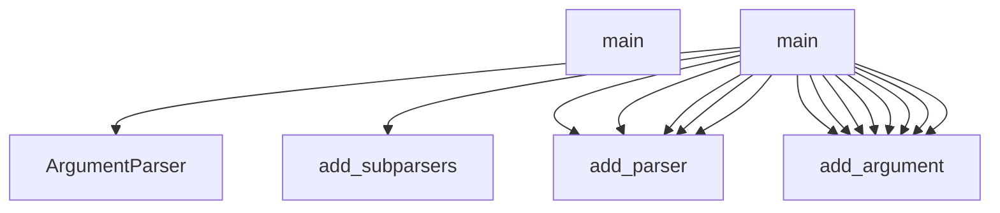

## Workflow: TestCppInheritance.test_cpp_function_calls_remain_call_kind

The `test_cpp_function_calls_remain_call_kind` workflow represents a critical path in the system. When this flow is triggered, execution begins in `test_inheritance.py`. From there, it coordinates with 2 different components. The primary interactions involve `_parse` and `len`.

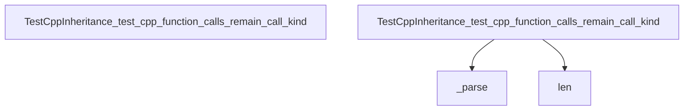

## Workflow: DBQueryAPI.get_domain_entities

The `get_domain_entities` workflow represents a critical path in the system. When this flow is triggered, execution begins in `query_api.py`. From there, it coordinates with 11 different components. The primary interactions involve `defaultdict`, `any`, and `filter`.

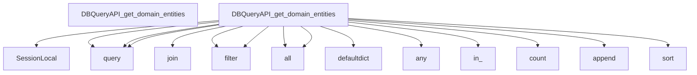

## Workflow: J.onClick

The `onClick` workflow represents a critical path in the system. When this flow is triggered, execution begins in `tom-select.complete.min.js`. From there, it coordinates with 3 different components. The primary interactions involve `blur`, `focus`, and `clearActiveItems`.

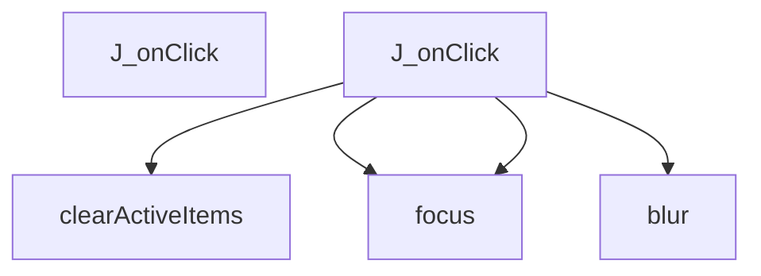

## Workflow: J.setup

The `setup` workflow represents a critical path in the system. When this flow is triggered, execution begins in `tom-select.complete.min.js`. From there, it coordinates with 57 different components. The primary interactions involve `enable`, `removeEventListener`, and `v`.

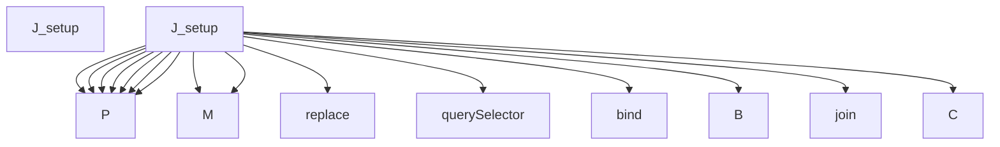

## Workflow: J.setupOptions

The `setupOptions` workflow represents a critical path in the system. When this flow is triggered, execution begins in `tom-select.complete.min.js`. From there, it coordinates with 3 different components. The primary interactions involve `y`, `registerOptionGroup`, and `addOptions`.

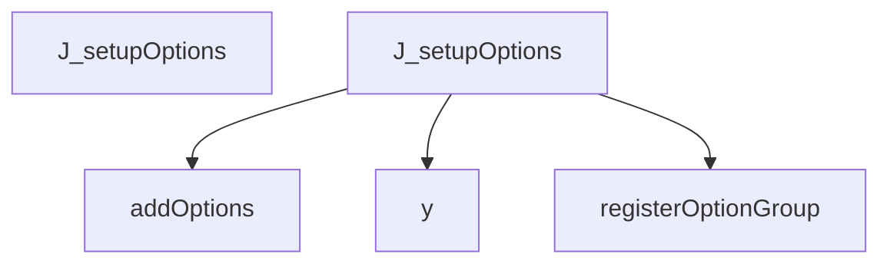

## Workflow: J.setupTemplates

The `setupTemplates` workflow represents a critical path in the system. When this flow is triggered, execution begins in `tom-select.complete.min.js`. From there, it coordinates with 73 different components. The primary interactions involve `a`, `$d`, and `zn`.

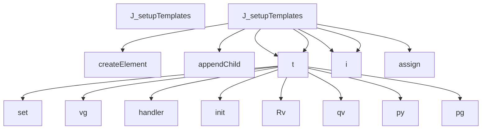

## Workflow: J.setupCallbacks

The `setupCallbacks` workflow represents a critical path in the system. When this flow is triggered, execution begins in `tom-select.complete.min.js`. From there, it coordinates with 1 different components. The primary interactions involve `on`.

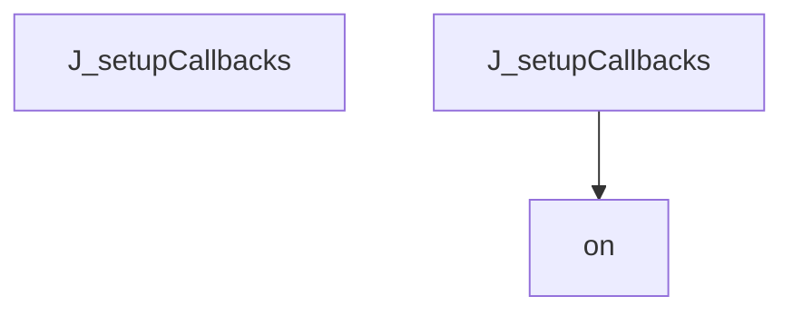

## Workflow: test_schema_setup

The `test_schema_setup` workflow represents a critical path in the system. When this flow is triggered, execution begins in `test_manager.py`. From there, it coordinates with 5 different components. The primary interactions involve `SessionLocal`, `execute`, and `len`.

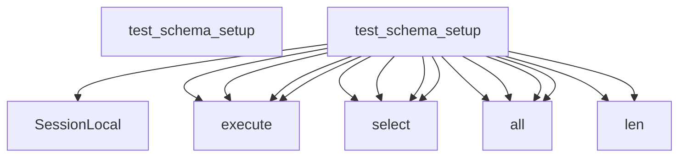

## Workflow: J.registerOption

The `registerOption` workflow represents a critical path in the system. When this flow is triggered, execution begins in `tom-select.complete.min.js`. From there, it coordinates with 1 different components. The primary interactions involve `addOption`.

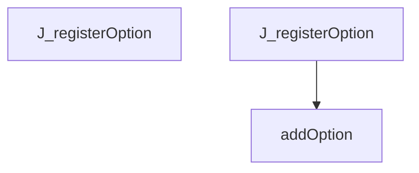

## Workflow: J.registerOptionGroup

The `registerOptionGroup` workflow represents a critical path in the system. When this flow is triggered, execution begins in `tom-select.complete.min.js`. From there, it coordinates with 1 different components. The primary interactions involve `q`.

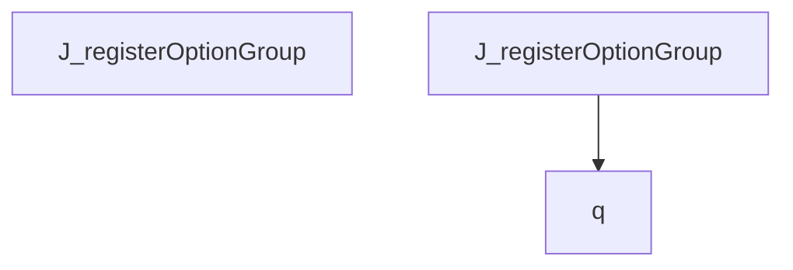

## Workflow: DBManager.ingest_project_data

The `ingest_project_data` workflow represents a critical path in the system. When this flow is triggered, execution begins in `manager.py`. From there, it coordinates with 7 different components. The primary interactions involve `commit`, `SessionLocal`, and `execute`.

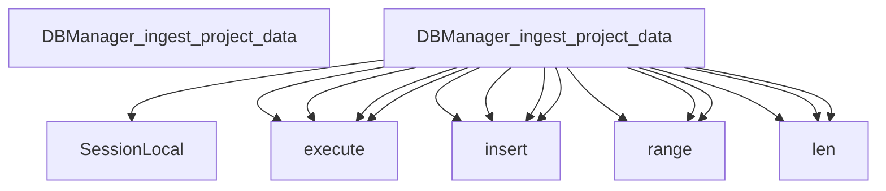

## Workflow: DocsCoordinator.generate_all

The `generate_all` workflow represents a critical path in the system. When this flow is triggered, execution begins in `coordinator.py`. From there, it coordinates with 3 different components. The primary interactions involve `makedirs`, `_render_index`, and `generate`.

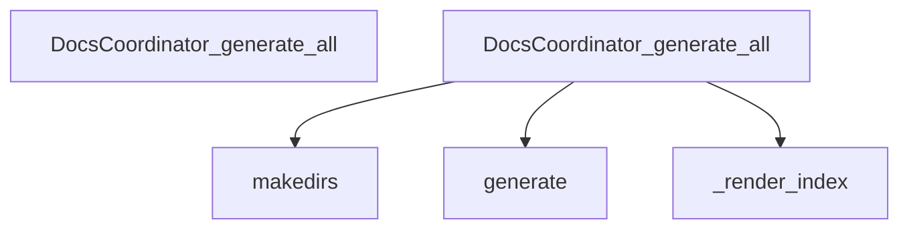

## Workflow: J.canCreate

The `canCreate` workflow represents a critical path in the system. When this flow is triggered, execution begins in `tom-select.complete.min.js`. From there, it coordinates with 1 different components. The primary interactions involve `call`.

```mermaid
graph TD
    Start[J_canCreate]


    J_canCreate --> call


```

## Workflow: J.clearActiveItems

The `clearActiveItems` workflow represents a critical path in the system. When this flow is triggered, execution begins in `tom-select.complete.min.js`. From there, it coordinates with 1 different components. The primary interactions involve `S`.

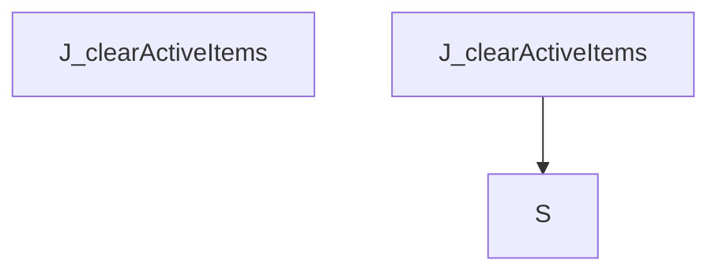

## Workflow: J.controlChildren

The `controlChildren` workflow represents a critical path in the system. When this flow is triggered, execution begins in `tom-select.complete.min.js`. From there, it coordinates with 2 different components. The primary interactions involve `from` and `querySelectorAll`.

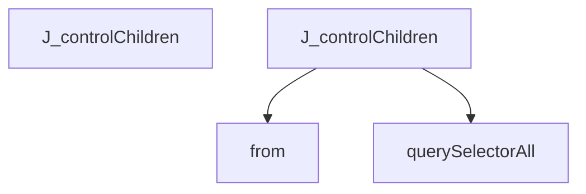

## Workflow: J.inputState

The `inputState` workflow represents a critical path in the system. When this flow is triggered, execution begins in `tom-select.complete.min.js`. From there, it coordinates with 4 different components. The primary interactions involve `setTextboxValue`, `toggle`, and `contains`.

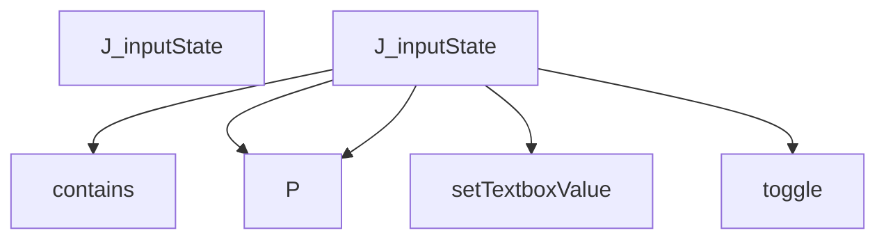

## Workflow: J.o

The `o` workflow represents a critical path in the system. When this flow is triggered, execution begins in `tom-select.complete.min.js`. From there, it coordinates with 4 different components. The primary interactions involve `w`, `N`, and `append`.

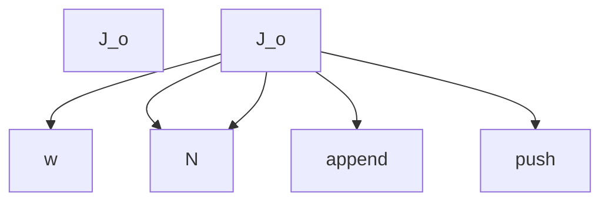

## Workflow: J.onPaste

The `onPaste` workflow represents a critical path in the system. When this flow is triggered, execution begins in `tom-select.complete.min.js`. From there, it coordinates with 9 different components. The primary interactions involve `H`, `y`, and `inputValue`.

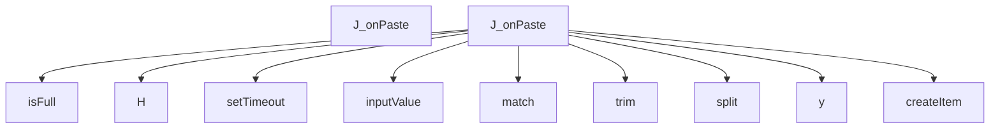

## Workflow: J.removeItem

The `removeItem` workflow represents a critical path in the system. When this flow is triggered, execution begins in `tom-select.complete.min.js`. From there, it coordinates with 14 different components. The primary interactions involve `positionDropdown`, `hasOwnProperty`, and `L`.

```mermaid
graph TD
    Start[J_removeItem]


    J_removeItem --> getItem


    J_removeItem --> L


    J_removeItem --> remove


    J_removeItem --> contains


    J_removeItem --> indexOf


    J_removeItem --> splice


    J_removeItem --> S


    J_removeItem --> splice


    J_removeItem --> hasOwnProperty


    J_removeItem --> removeOption


    J_removeItem --> setCaret


    J_removeItem --> updateOriginalInput


    J_removeItem --> refreshState


    J_removeItem --> positionDropdown


    J_removeItem --> trigger


```

## Workflow: J.selectAll

The `selectAll` workflow represents a critical path in the system. When this flow is triggered, execution begins in `tom-select.complete.min.js`. From there, it coordinates with 5 different components. The primary interactions involve `hideInput`, `close`, and `C`.

```mermaid
graph TD
    Start[J_selectAll]


    J_selectAll --> controlChildren


    J_selectAll --> hideInput


    J_selectAll --> close


    J_selectAll --> C


    C --> push


```

## Workflow: TestCppReturnTypes._parse

The `_parse` workflow represents a critical path in the system. When this flow is triggered, execution begins in `test_return_types.py`. From there, it coordinates with 3 different components. The primary interactions involve `analyze_file`, `ASTParser`, and `set_language`.

```mermaid
graph TD
    Start[TestCppReturnTypes__parse]


    TestCppReturnTypes__parse --> ASTParser


    TestCppReturnTypes__parse --> set_language


    TestCppReturnTypes__parse --> analyze_file


```

## Workflow: b.getSortFunction

The `getSortFunction` workflow represents a critical path in the system. When this flow is triggered, execution begins in `tom-select.complete.min.js`. From there, it coordinates with 2 different components. The primary interactions involve `_getSortFunction` and `prepareSearch`.

```mermaid
graph TD
    Start[b_getSortFunction]


    b_getSortFunction --> prepareSearch


    b_getSortFunction --> _getSortFunction


```

## Workflow: test_cpp_nested_namespaces

The `test_cpp_nested_namespaces` workflow represents a critical path in the system. When this flow is triggered, execution begins in `test_cpp.py`. From there, it coordinates with 5 different components. The primary interactions involve `dedent`, `extract_symbols`, and `ASTParser`.

```mermaid
graph TD
    Start[test_cpp_nested_namespaces]


    test_cpp_nested_namespaces --> ASTParser


    test_cpp_nested_namespaces --> set_language


    test_cpp_nested_namespaces --> dedent


    test_cpp_nested_namespaces --> extract_symbols


    test_cpp_nested_namespaces --> len


```

## Workflow: test_find_calls_by_success

The `test_find_calls_by_success` workflow represents a critical path in the system. When this flow is triggered, execution begins in `test_query_api_references.py`. From there, it coordinates with 2 different components. The primary interactions involve `find_calls_by` and `len`.

```mermaid
graph TD
    Start[test_find_calls_by_success]


    test_find_calls_by_success --> find_calls_by


    test_find_calls_by_success --> len


```

## Workflow: test_find_files_importing_success

The `test_find_files_importing_success` workflow represents a critical path in the system. When this flow is triggered, execution begins in `test_query_api.py`. From there, it coordinates with 2 different components. The primary interactions involve `len` and `find_files_importing`.

```mermaid
graph TD
    Start[test_find_files_importing_success]


    test_find_files_importing_success --> find_files_importing


    test_find_files_importing_success --> len


    test_find_files_importing_success --> find_files_importing


    test_find_files_importing_success --> len


```

## Workflow: test_json_safely_ignored

The `test_json_safely_ignored` workflow represents a critical path in the system. When this flow is triggered, execution begins in `test_json.py`. From there, it coordinates with 4 different components. The primary interactions involve `extract_symbols`, `ASTParser`, and `set_language`.

```mermaid
graph TD
    Start[test_json_safely_ignored]


    test_json_safely_ignored --> ASTParser


    test_json_safely_ignored --> set_language


    test_json_safely_ignored --> extract_symbols


    test_json_safely_ignored --> extract_dependencies


```


---
*Generated by DECODE NLG | [← Back to Index](index.md)*