# Data Flow
> **Onboarding question:** How does information move?


## Workflow: main

The `main` workflow represents a critical path in the system. When this flow is triggered, execution begins in `test_main.cpp`. From there, it coordinates with 82 different components. The primary interactions involve `lstrip`, `exists`, and `connect`.

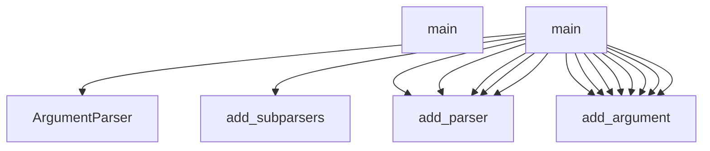

## Workflow: TestCppInheritance.test_cpp_function_calls_remain_call_kind

The `test_cpp_function_calls_remain_call_kind` workflow represents a critical path in the system. When this flow is triggered, execution begins in `test_inheritance.py`. From there, it coordinates with 2 different components. The primary interactions involve `_parse` and `len`.

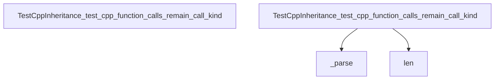

## Workflow: DBQueryAPI.get_domain_entities

The `get_domain_entities` workflow represents a critical path in the system. When this flow is triggered, execution begins in `query_api.py`. From there, it coordinates with 11 different components. The primary interactions involve `join`, `query`, and `SessionLocal`.

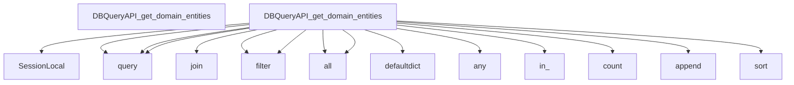

## Workflow: J.onClick

The `onClick` workflow represents a critical path in the system. When this flow is triggered, execution begins in `tom-select.complete.min.js`. From there, it coordinates with 3 different components. The primary interactions involve `blur`, `focus`, and `clearActiveItems`.

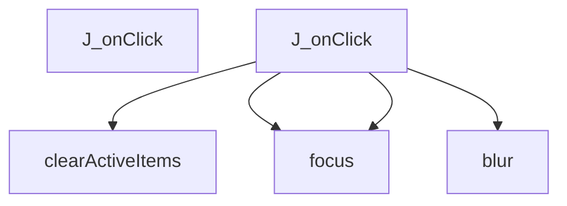

## Workflow: J.setup

The `setup` workflow represents a critical path in the system. When this flow is triggered, execution begins in `tom-select.complete.min.js`. From there, it coordinates with 57 different components. The primary interactions involve `create`, `updateOriginalInput`, and `P`.

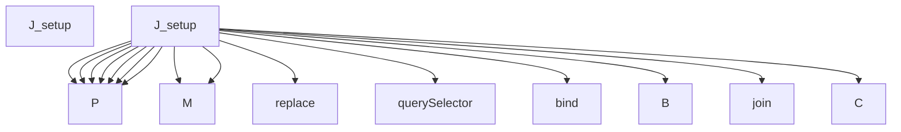

## Workflow: J.setupOptions

The `setupOptions` workflow represents a critical path in the system. When this flow is triggered, execution begins in `tom-select.complete.min.js`. From there, it coordinates with 3 different components. The primary interactions involve `addOptions`, `y`, and `registerOptionGroup`.

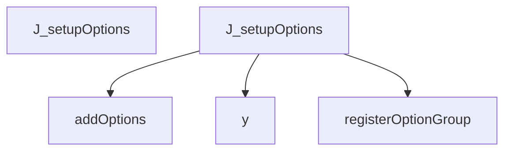

## Workflow: J.setupTemplates

The `setupTemplates` workflow represents a critical path in the system. When this flow is triggered, execution begins in `tom-select.complete.min.js`. From there, it coordinates with 73 different components. The primary interactions involve `Eu`, `pg`, and `_create`.

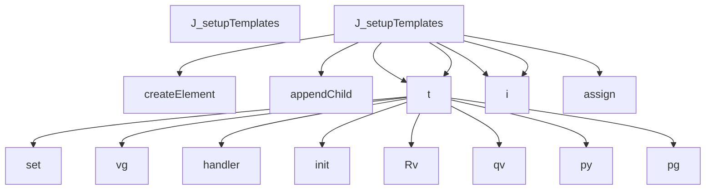

## Workflow: J.setupCallbacks

The `setupCallbacks` workflow represents a critical path in the system. When this flow is triggered, execution begins in `tom-select.complete.min.js`. From there, it coordinates with 1 different components. The primary interactions involve `on`.

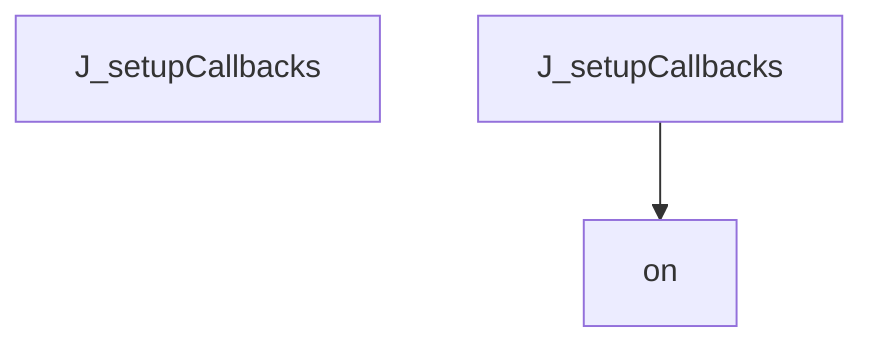

## Workflow: test_schema_setup

The `test_schema_setup` workflow represents a critical path in the system. When this flow is triggered, execution begins in `test_manager.py`. From there, it coordinates with 5 different components. The primary interactions involve `SessionLocal`, `execute`, and `len`.

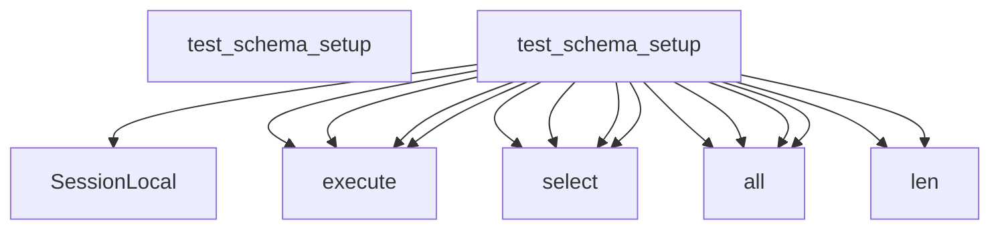

## Workflow: J.registerOption

The `registerOption` workflow represents a critical path in the system. When this flow is triggered, execution begins in `tom-select.complete.min.js`. From there, it coordinates with 1 different components. The primary interactions involve `addOption`.

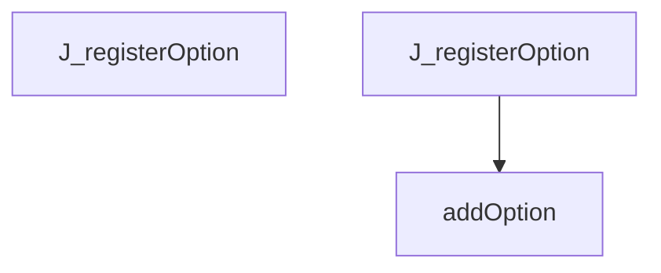

## Workflow: J.registerOptionGroup

The `registerOptionGroup` workflow represents a critical path in the system. When this flow is triggered, execution begins in `tom-select.complete.min.js`. From there, it coordinates with 1 different components. The primary interactions involve `q`.

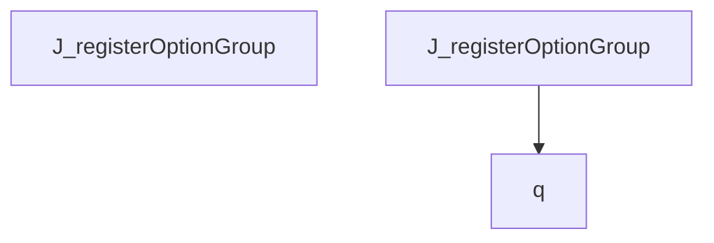

## Workflow: ArchitectureGenerator.gather_data

The `gather_data` workflow represents a critical path in the system. When this flow is triggered, execution begins in `architecture.py`. From there, it coordinates with 2 different components. The primary interactions involve `get_module_structure` and `get_cross_module_edges`.

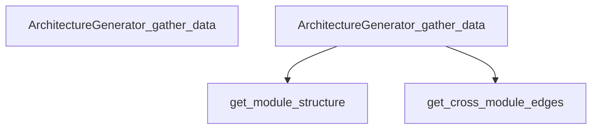

## Workflow: BaseGenerator._generate_ai_summary

The `_generate_ai_summary` workflow represents a critical path in the system. When this flow is triggered, execution begins in `base_generator.py`. From there, it coordinates with 6 different components. The primary interactions involve `create`, `strip`, and `dumps`.

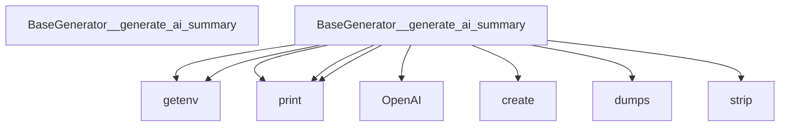

## Workflow: DocsCoordinator.generate_all

The `generate_all` workflow represents a critical path in the system. When this flow is triggered, execution begins in `coordinator.py`. From there, it coordinates with 3 different components. The primary interactions involve `generate`, `makedirs`, and `_render_index`.

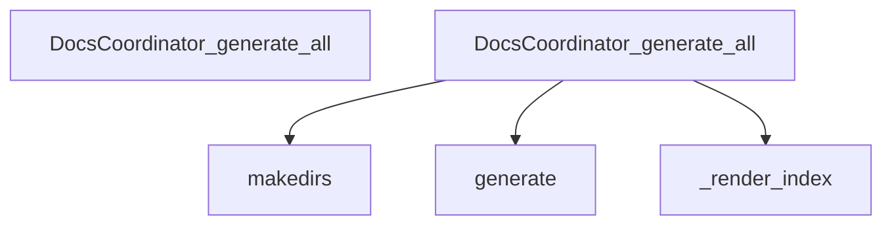

## Workflow: Ey

The `Ey` workflow represents a critical path in the system. When this flow is triggered, execution begins in `vis-network.min.js`. From there, it coordinates with 2 different components. The primary interactions involve `create` and `qv`.

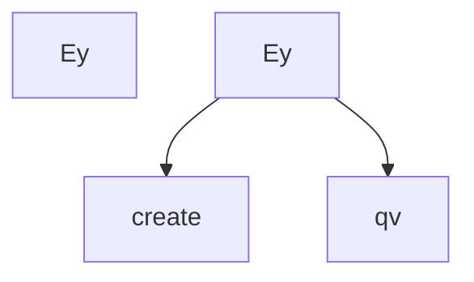

## Workflow: J.addOption

The `addOption` workflow represents a critical path in the system. When this flow is triggered, execution begins in `tom-select.complete.min.js`. From there, it coordinates with 5 different components. The primary interactions involve `q`, `trigger`, and `addOptions`.

```mermaid
graph TD
    Start[J_addOption]


    J_addOption --> isArray


    J_addOption --> addOptions


    J_addOption --> q


    J_addOption --> hasOwnProperty


    J_addOption --> trigger


```

## Workflow: J.advanceSelection

The `advanceSelection` workflow represents a critical path in the system. When this flow is triggered, execution begins in `tom-select.complete.min.js`. From there, it coordinates with 8 different components. The primary interactions involve `getLastActive`, `K`, and `setActiveItemClass`.

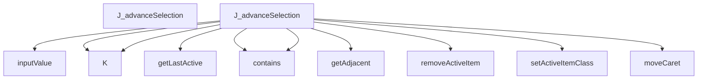

## Workflow: J.clearOptions

The `clearOptions` workflow represents a critical path in the system. When this flow is triggered, execution begins in `tom-select.complete.min.js`. From there, it coordinates with 4 different components. The primary interactions involve `trigger`, `y`, and `clearCache`.

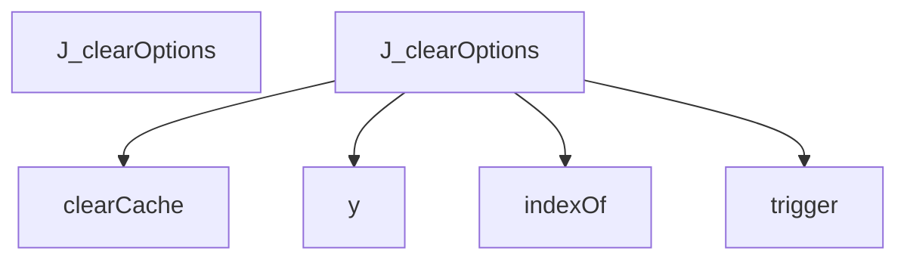

## Workflow: J.getScoreFunction

The `getScoreFunction` workflow represents a critical path in the system. When this flow is triggered, execution begins in `tom-select.complete.min.js`. From there, it coordinates with 2 different components. The primary interactions involve `getSearchOptions` and `getScoreFunction`.

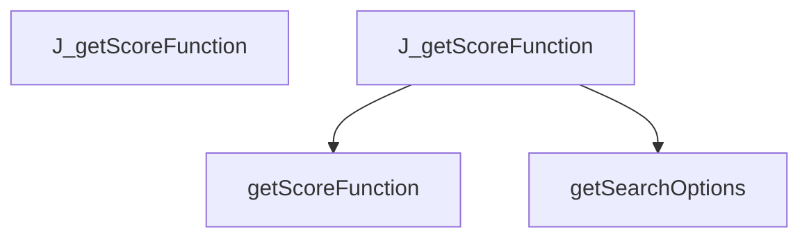

## Workflow: TestPythonInheritance.test_single_inheritance_detected

The `test_single_inheritance_detected` workflow represents a critical path in the system. When this flow is triggered, execution begins in `test_inheritance.py`. From there, it coordinates with 3 different components. The primary interactions involve `dedent`, `_parse`, and `len`.

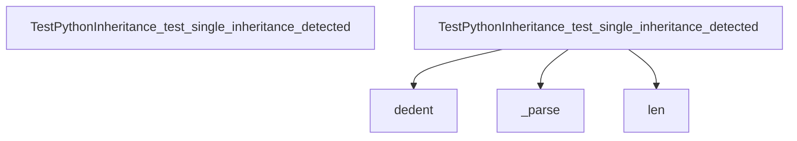

## Workflow: language_repo

The `language_repo` workflow represents a critical path in the system. When this flow is triggered, execution begins in `test_language_detector.py`. From there, it coordinates with 2 different components. The primary interactions involve `write_text` and `str`.

```mermaid
graph TD
    Start[language_repo]


    language_repo --> write_text


    language_repo --> write_text


    language_repo --> write_text


    language_repo --> write_text


    language_repo --> write_text


    language_repo --> write_text


    language_repo --> str


    language_repo --> str


    language_repo --> str


    language_repo --> str


    language_repo --> str


    language_repo --> str


```

## Workflow: test_find_symbol_missing

The `test_find_symbol_missing` workflow represents a critical path in the system. When this flow is triggered, execution begins in `test_query_api.py`. From there, it coordinates with 3 different components. The primary interactions involve `find_symbol`, `isinstance`, and `len`.

```mermaid
graph TD
    Start[test_find_symbol_missing]


    test_find_symbol_missing --> find_symbol


    test_find_symbol_missing --> isinstance


    test_find_symbol_missing --> len


```

## Workflow: test_get_existing_files

The `test_get_existing_files` workflow represents a critical path in the system. When this flow is triggered, execution begins in `test_manager.py`. From there, it coordinates with 3 different components. The primary interactions involve `len`, `isinstance`, and `get_existing_files`.

```mermaid
graph TD
    Start[test_get_existing_files]


    test_get_existing_files --> get_existing_files


    test_get_existing_files --> isinstance


    test_get_existing_files --> len


```

## Workflow: test_language_detection

The `test_language_detection` workflow represents a critical path in the system. When this flow is triggered, execution begins in `test_language_detector.py`. From there, it coordinates with 1 different components. The primary interactions involve `detect_language`.

```mermaid
graph TD
    Start[test_language_detection]


    test_language_detection --> detect_language


    test_language_detection --> detect_language


    test_language_detection --> detect_language


    test_language_detection --> detect_language


    test_language_detection --> detect_language


    test_language_detection --> detect_language


```

## Workflow: test_python_garbage_safety

The `test_python_garbage_safety` workflow represents a critical path in the system. When this flow is triggered, execution begins in `test_ast_parser.py`. From there, it coordinates with 6 different components. The primary interactions involve `isinstance`, `dedent`, and `ASTParser`.

```mermaid
graph TD
    Start[test_python_garbage_safety]


    test_python_garbage_safety --> ASTParser


    test_python_garbage_safety --> set_language


    test_python_garbage_safety --> dedent


    test_python_garbage_safety --> extract_symbols


    test_python_garbage_safety --> extract_dependencies


    test_python_garbage_safety --> isinstance


    test_python_garbage_safety --> isinstance


```

## Workflow: test_walker_nonexistent_directory

The `test_walker_nonexistent_directory` workflow represents a critical path in the system. When this flow is triggered, execution begins in `test_fs_walker.py`. From there, it coordinates with 2 different components. The primary interactions involve `walk_repository` and `len`.

```mermaid
graph TD
    Start[test_walker_nonexistent_directory]


    test_walker_nonexistent_directory --> walk_repository


    test_walker_nonexistent_directory --> len


```


---
*Generated by DECODE NLG | [← Back to Index](index.md)*