# Data Flow
> **Onboarding question:** How does information move?


## Workflow: main

The `main` workflow represents a critical path in the system. When this flow is triggered, execution begins in `test_main.cpp`. From there, it coordinates with 82 different components. The primary interactions involve `connect`, `FileSystemLoader`, and `execute`.

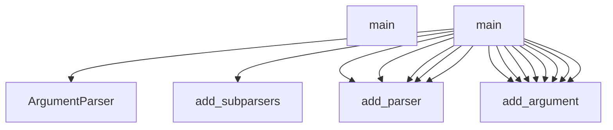

## Workflow: TestCppInheritance.test_cpp_function_calls_remain_call_kind

The `test_cpp_function_calls_remain_call_kind` workflow represents a critical path in the system. When this flow is triggered, execution begins in `test_inheritance.py`. From there, it coordinates with 2 different components. The primary interactions involve `_parse` and `len`.

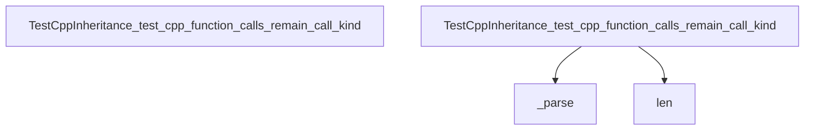

## Workflow: DBQueryAPI.get_domain_entities

The `get_domain_entities` workflow represents a critical path in the system. When this flow is triggered, execution begins in `query_api.py`. From there, it coordinates with 11 different components. The primary interactions involve `filter`, `query`, and `count`.

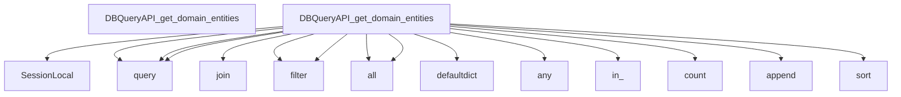

## Workflow: J.onClick

The `onClick` workflow represents a critical path in the system. When this flow is triggered, execution begins in `tom-select.complete.min.js`. From there, it coordinates with 3 different components. The primary interactions involve `clearActiveItems`, `blur`, and `focus`.

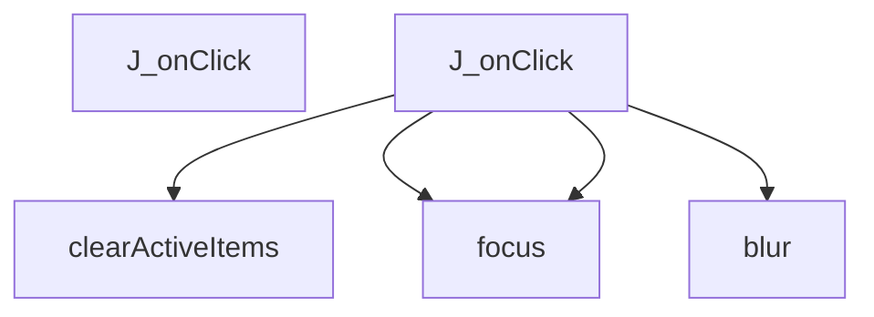

## Workflow: J.setup

The `setup` workflow represents a critical path in the system. When this flow is triggered, execution begins in `tom-select.complete.min.js`. From there, it coordinates with 57 different components. The primary interactions involve `close`, `M`, and `h`.

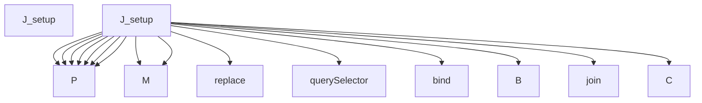

## Workflow: J.setupOptions

The `setupOptions` workflow represents a critical path in the system. When this flow is triggered, execution begins in `tom-select.complete.min.js`. From there, it coordinates with 3 different components. The primary interactions involve `registerOptionGroup`, `addOptions`, and `y`.

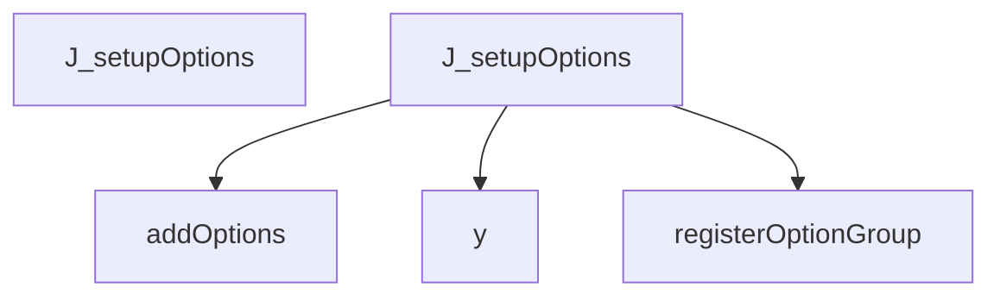

## Workflow: J.setupTemplates

The `setupTemplates` workflow represents a critical path in the system. When this flow is triggered, execution begins in `tom-select.complete.min.js`. From there, it coordinates with 73 different components. The primary interactions involve `setImages`, `pg`, and `setOptions`.

```mermaid
graph TD
    Start[J_setupTemplates]


    J_setupTemplates --> createElement


    J_setupTemplates --> appendChild


    J_setupTemplates --> t


    J_setupTemplates --> i


    J_setupTemplates --> i


    J_setupTemplates --> t


    J_setupTemplates --> assign


    i --> off


    i --> apply


    i --> d


    i --> call


    i --> resolve


    i --> then


    i --> i


    i --> i


```

## Workflow: J.setupCallbacks

The `setupCallbacks` workflow represents a critical path in the system. When this flow is triggered, execution begins in `tom-select.complete.min.js`. From there, it coordinates with 1 different components. The primary interactions involve `on`.

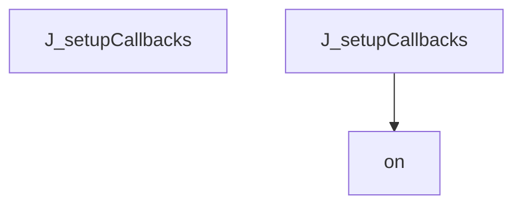

## Workflow: test_schema_setup

The `test_schema_setup` workflow represents a critical path in the system. When this flow is triggered, execution begins in `test_manager.py`. From there, it coordinates with 5 different components. The primary interactions involve `execute`, `select`, and `SessionLocal`.

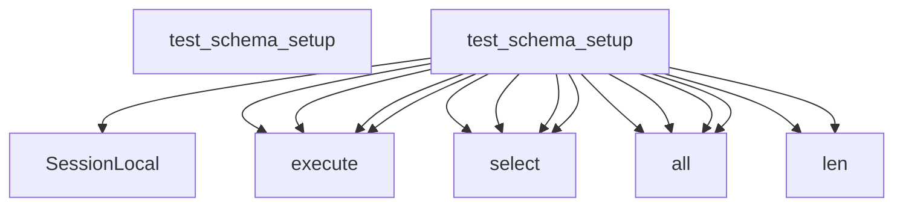

## Workflow: J.registerOption

The `registerOption` workflow represents a critical path in the system. When this flow is triggered, execution begins in `tom-select.complete.min.js`. From there, it coordinates with 1 different components. The primary interactions involve `addOption`.

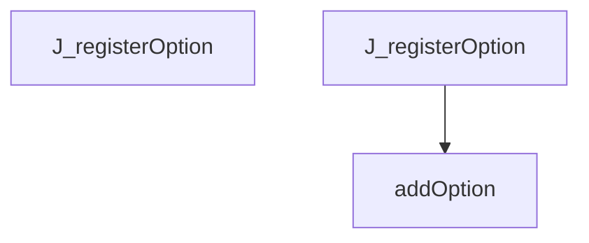

## Workflow: J.registerOptionGroup

The `registerOptionGroup` workflow represents a critical path in the system. When this flow is triggered, execution begins in `tom-select.complete.min.js`. From there, it coordinates with 1 different components. The primary interactions involve `q`.

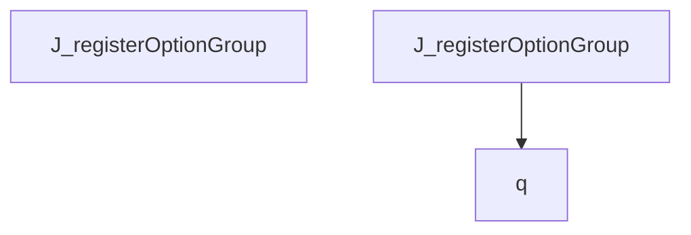

## Workflow: ArchitectureGenerator.gather_data

The `gather_data` workflow represents a critical path in the system. When this flow is triggered, execution begins in `architecture.py`. From there, it coordinates with 2 different components. The primary interactions involve `get_module_structure` and `get_cross_module_edges`.

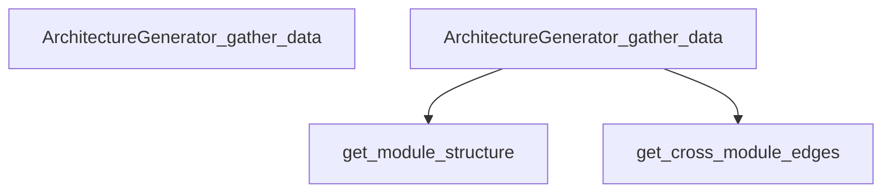

## Workflow: DBManager.remove_stale_files

The `remove_stale_files` workflow represents a critical path in the system. When this flow is triggered, execution begins in `manager.py`. From there, it coordinates with 9 different components. The primary interactions involve `range`, `in_`, and `rollback`.

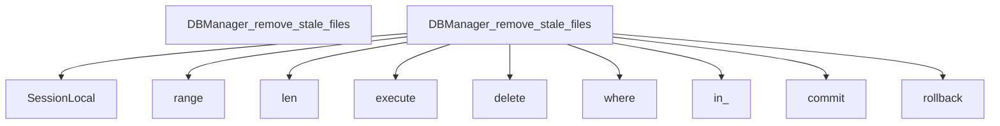

## Workflow: DBQueryAPI.find_callers_of

The `find_callers_of` workflow represents a critical path in the system. When this flow is triggered, execution begins in `query_api.py`. From there, it coordinates with 6 different components. The primary interactions involve `select`, `execute`, and `SessionLocal`.

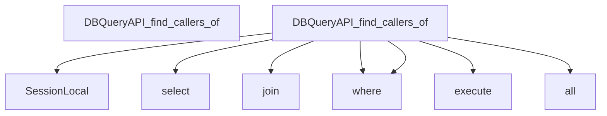

## Workflow: DBQueryAPI.get_class_hierarchy

The `get_class_hierarchy` workflow represents a critical path in the system. When this flow is triggered, execution begins in `query_api.py`. From there, it coordinates with 6 different components. The primary interactions involve `select`, `execute`, and `SessionLocal`.

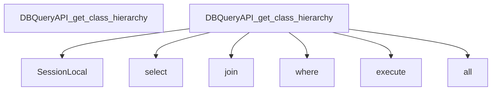

## Workflow: DBQueryAPI.get_module_structure

The `get_module_structure` workflow represents a critical path in the system. When this flow is triggered, execution begins in `query_api.py`. From there, it coordinates with 13 different components. The primary interactions involve `split`, `set`, and `query`.

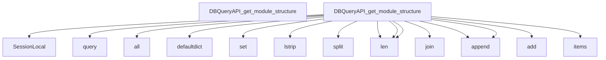

## Workflow: J.addOption

The `addOption` workflow represents a critical path in the system. When this flow is triggered, execution begins in `tom-select.complete.min.js`. From there, it coordinates with 5 different components. The primary interactions involve `hasOwnProperty`, `isArray`, and `addOptions`.

```mermaid
graph TD
    Start[J_addOption]


    J_addOption --> isArray


    J_addOption --> addOptions


    J_addOption --> q


    J_addOption --> hasOwnProperty


    J_addOption --> trigger


```

## Workflow: J.enable

The `enable` workflow represents a critical path in the system. When this flow is triggered, execution begins in `tom-select.complete.min.js`. From there, it coordinates with 1 different components. The primary interactions involve `unlock`.

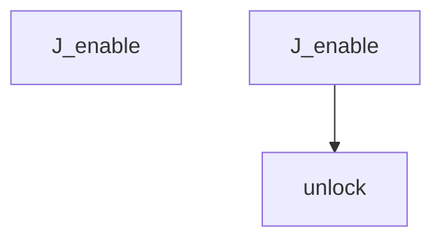

## Workflow: J.hook

The `hook` workflow represents a critical path in the system. When this flow is triggered, execution begins in `tom-select.complete.min.js`. From there, it coordinates with 1 different components. The primary interactions involve `apply`.

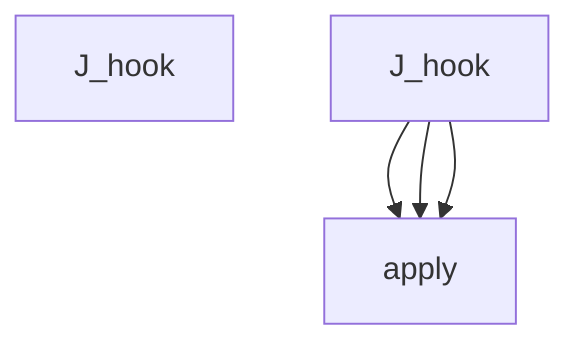

## Workflow: J.insertAtCaret

The `insertAtCaret` workflow represents a critical path in the system. When this flow is triggered, execution begins in `tom-select.complete.min.js`. From there, it coordinates with 2 different components. The primary interactions involve `setCaret` and `insertBefore`.

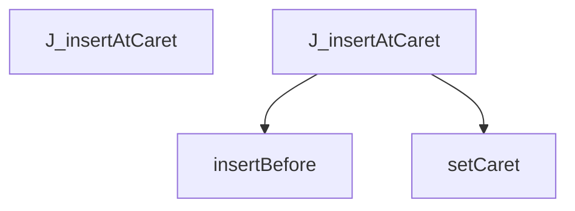

## Workflow: J.onBlur

The `onBlur` workflow represents a critical path in the system. When this flow is triggered, execution begins in `tom-select.complete.min.js`. From there, it coordinates with 32 different components. The primary interactions involve `setImages`, `setOptions`, and `createItem`.

```mermaid
graph TD
    Start[J_onBlur]


    J_onBlur --> hasFocus


    J_onBlur --> close


    J_onBlur --> setActiveItem


    J_onBlur --> setCaret


    J_onBlur --> trigger


    J_onBlur --> createItem


    J_onBlur --> i


    i --> off


    i --> apply


    i --> d


    i --> call


    i --> resolve


    i --> then


    i --> i


    i --> i


```

## Workflow: J.render

The `render` workflow represents a critical path in the system. When this flow is triggered, execution begins in `tom-select.complete.min.js`. From there, it coordinates with 1 different components. The primary interactions involve `_render`.

```mermaid
graph TD
    Start[J_render]


    J_render --> _render


```

## Workflow: TestCppInheritance.test_inheritance_caller_is_child_class

The `test_inheritance_caller_is_child_class` workflow represents a critical path in the system. When this flow is triggered, execution begins in `test_inheritance.py`. From there, it coordinates with 3 different components. The primary interactions involve `_parse`, `any`, and `dedent`.

```mermaid
graph TD
    Start[TestCppInheritance_test_inheritance_caller_is_child_class]


    TestCppInheritance_test_inheritance_caller_is_child_class --> dedent


    TestCppInheritance_test_inheritance_caller_is_child_class --> _parse


    TestCppInheritance_test_inheritance_caller_is_child_class --> any


```

## Workflow: selectNode

The `selectNode` workflow represents a critical path in the system. When this flow is triggered, execution begins in `utils.js`. From there, it coordinates with 9 different components. The primary interactions involve `concat`, `selectNodes`, and `neighbourhoodHighlight`.

```mermaid
graph TD
    Start[selectNode]


    selectNode --> selectNodes


    selectNode --> neighbourhoodHighlight


    neighbourhoodHighlight --> get


    neighbourhoodHighlight --> getConnectedNodes


    neighbourhoodHighlight --> concat


    neighbourhoodHighlight --> getConnectedNodes


    neighbourhoodHighlight --> hasOwnProperty


    neighbourhoodHighlight --> push


    neighbourhoodHighlight --> update


    neighbourhoodHighlight --> hasOwnProperty


    neighbourhoodHighlight --> push


    neighbourhoodHighlight --> update


    selectNodes --> selectNodes


    selectNodes --> filterHighlight


    filterHighlight --> get


```

## Workflow: test_go_basic_symbols

The `test_go_basic_symbols` workflow represents a critical path in the system. When this flow is triggered, execution begins in `test_go.py`. From there, it coordinates with 5 different components. The primary interactions involve `set_language`, `ASTParser`, and `dedent`.

```mermaid
graph TD
    Start[test_go_basic_symbols]


    test_go_basic_symbols --> ASTParser


    test_go_basic_symbols --> set_language


    test_go_basic_symbols --> dedent


    test_go_basic_symbols --> extract_symbols


    test_go_basic_symbols --> len


```

## Workflow: test_go_garbage_safety

The `test_go_garbage_safety` workflow represents a critical path in the system. When this flow is triggered, execution begins in `test_go.py`. From there, it coordinates with 4 different components. The primary interactions involve `extract_dependencies`, `set_language`, and `ASTParser`.

```mermaid
graph TD
    Start[test_go_garbage_safety]


    test_go_garbage_safety --> ASTParser


    test_go_garbage_safety --> set_language


    test_go_garbage_safety --> extract_dependencies


    test_go_garbage_safety --> isinstance


```

## Workflow: test_language_detection

The `test_language_detection` workflow represents a critical path in the system. When this flow is triggered, execution begins in `test_language_detector.py`. From there, it coordinates with 1 different components. The primary interactions involve `detect_language`.

```mermaid
graph TD
    Start[test_language_detection]


    test_language_detection --> detect_language


    test_language_detection --> detect_language


    test_language_detection --> detect_language


    test_language_detection --> detect_language


    test_language_detection --> detect_language


    test_language_detection --> detect_language


```

## Workflow: test_python_garbage_safety

The `test_python_garbage_safety` workflow represents a critical path in the system. When this flow is triggered, execution begins in `test_ast_parser.py`. From there, it coordinates with 6 different components. The primary interactions involve `extract_dependencies`, `set_language`, and `ASTParser`.

```mermaid
graph TD
    Start[test_python_garbage_safety]


    test_python_garbage_safety --> ASTParser


    test_python_garbage_safety --> set_language


    test_python_garbage_safety --> dedent


    test_python_garbage_safety --> extract_symbols


    test_python_garbage_safety --> extract_dependencies


    test_python_garbage_safety --> isinstance


    test_python_garbage_safety --> isinstance


```


---
*Generated by DECODE NLG | [← Back to Index](index.md)*