# Data Flow
> **Onboarding question:** How does information move?


## Workflow: main

The `main` workflow represents a critical path in the system. When this flow is triggered, execution begins in `test_main.cpp`. From there, it coordinates with 82 different components. The primary interactions involve `add`, `open`, and `Network`.

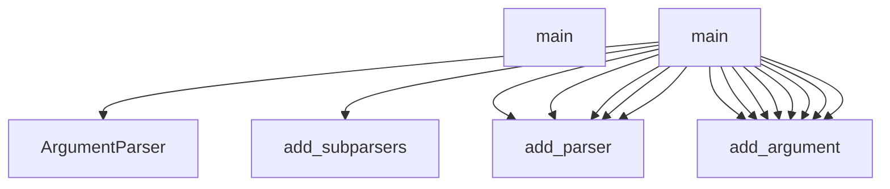

## Workflow: TestCppInheritance.test_cpp_function_calls_remain_call_kind

The `test_cpp_function_calls_remain_call_kind` workflow represents a critical path in the system. When this flow is triggered, execution begins in `test_inheritance.py`. From there, it coordinates with 2 different components. The primary interactions involve `len` and `_parse`.

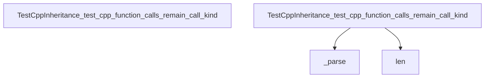

## Workflow: DBQueryAPI.get_domain_entities

The `get_domain_entities` workflow represents a critical path in the system. When this flow is triggered, execution begins in `query_api.py`. From there, it coordinates with 11 different components. The primary interactions involve `any`, `all`, and `query`.

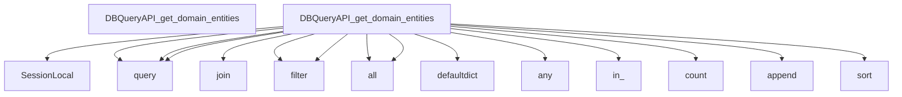

## Workflow: J.onClick

The `onClick` workflow represents a critical path in the system. When this flow is triggered, execution begins in `tom-select.complete.min.js`. From there, it coordinates with 3 different components. The primary interactions involve `blur`, `focus`, and `clearActiveItems`.

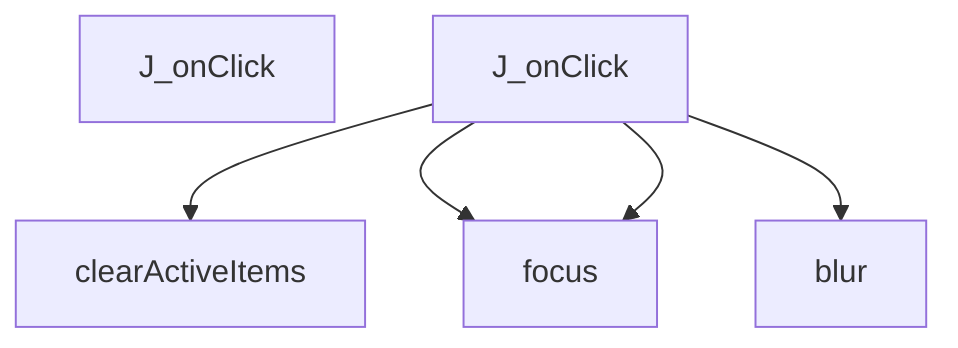

## Workflow: J.setup

The `setup` workflow represents a critical path in the system. When this flow is triggered, execution begins in `tom-select.complete.min.js`. From there, it coordinates with 57 different components. The primary interactions involve `o`, `insertAdjacentElement`, and `create`.

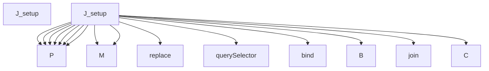

## Workflow: J.setupOptions

The `setupOptions` workflow represents a critical path in the system. When this flow is triggered, execution begins in `tom-select.complete.min.js`. From there, it coordinates with 3 different components. The primary interactions involve `y`, `registerOptionGroup`, and `addOptions`.

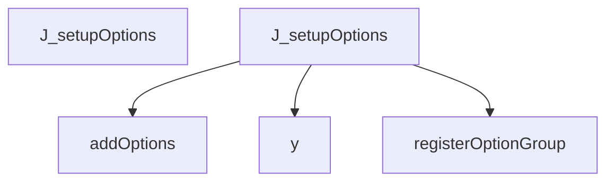

## Workflow: J.setupTemplates

The `setupTemplates` workflow represents a critical path in the system. When this flow is triggered, execution begins in `tom-select.complete.min.js`. From there, it coordinates with 73 different components. The primary interactions involve `Cm`, `_determineBrowserMethod`, and `lu`.

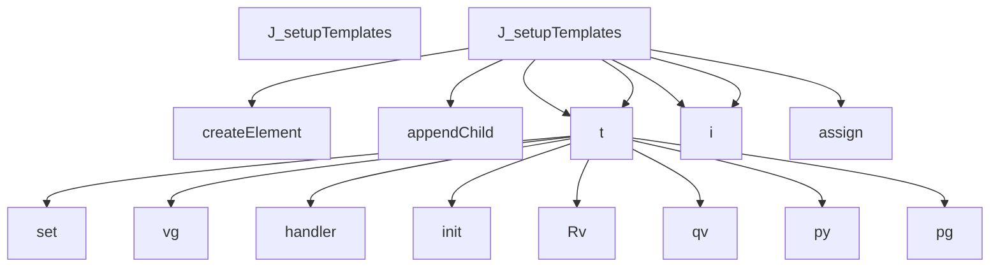

## Workflow: J.setupCallbacks

The `setupCallbacks` workflow represents a critical path in the system. When this flow is triggered, execution begins in `tom-select.complete.min.js`. From there, it coordinates with 1 different components. The primary interactions involve `on`.

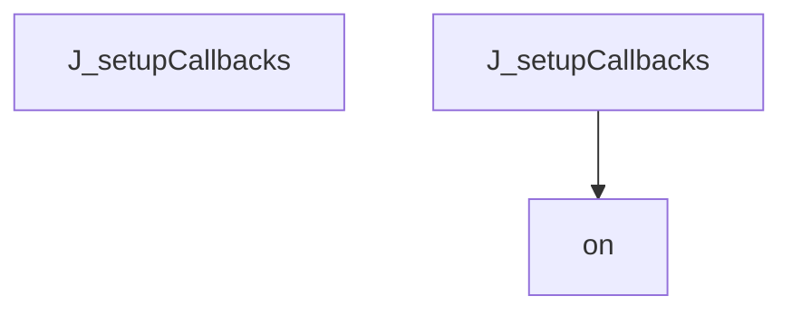

## Workflow: test_schema_setup

The `test_schema_setup` workflow represents a critical path in the system. When this flow is triggered, execution begins in `test_manager.py`. From there, it coordinates with 5 different components. The primary interactions involve `select`, `execute`, and `all`.

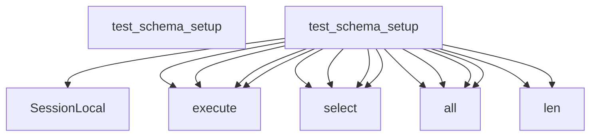

## Workflow: J.registerOption

The `registerOption` workflow represents a critical path in the system. When this flow is triggered, execution begins in `tom-select.complete.min.js`. From there, it coordinates with 1 different components. The primary interactions involve `addOption`.

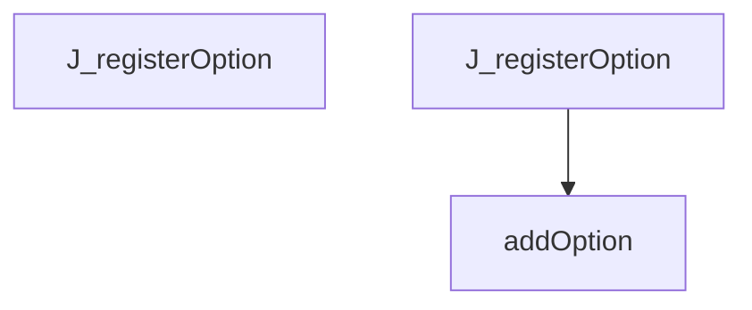

## Workflow: J.registerOptionGroup

The `registerOptionGroup` workflow represents a critical path in the system. When this flow is triggered, execution begins in `tom-select.complete.min.js`. From there, it coordinates with 1 different components. The primary interactions involve `q`.

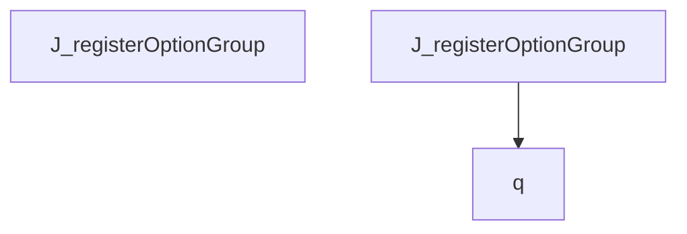

## Workflow: DBQueryAPI.get_class_hierarchy_full

The `get_class_hierarchy_full` workflow represents a critical path in the system. When this flow is triggered, execution begins in `query_api.py`. From there, it coordinates with 6 different components. The primary interactions involve `select`, `execute`, and `all`.

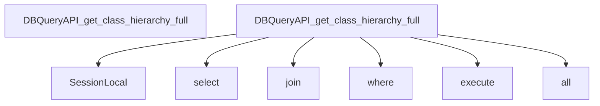

## Workflow: DBQueryAPI.get_dependency_clusters

The `get_dependency_clusters` workflow represents a critical path in the system. When this flow is triggered, execution begins in `query_api.py`. From there, it coordinates with 1 different components. The primary interactions involve `get_module_structure`.

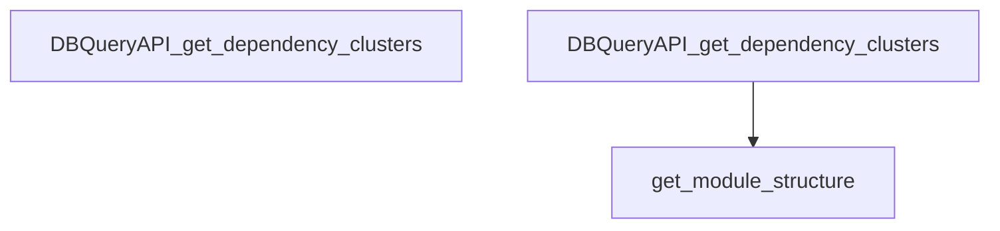

## Workflow: J.addOption

The `addOption` workflow represents a critical path in the system. When this flow is triggered, execution begins in `tom-select.complete.min.js`. From there, it coordinates with 5 different components. The primary interactions involve `q`, `addOptions`, and `hasOwnProperty`.

```mermaid
graph TD
    Start[J_addOption]


    J_addOption --> isArray


    J_addOption --> addOptions


    J_addOption --> q


    J_addOption --> hasOwnProperty


    J_addOption --> trigger


```

## Workflow: J.onFocus

The `onFocus` workflow represents a critical path in the system. When this flow is triggered, execution begins in `tom-select.complete.min.js`. From there, it coordinates with 7 different components. The primary interactions involve `refreshOptions`, `H`, and `showInput`.

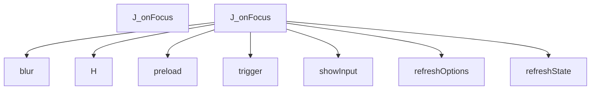

## Workflow: J.selectAll

The `selectAll` workflow represents a critical path in the system. When this flow is triggered, execution begins in `tom-select.complete.min.js`. From there, it coordinates with 5 different components. The primary interactions involve `hideInput`, `controlChildren`, and `close`.

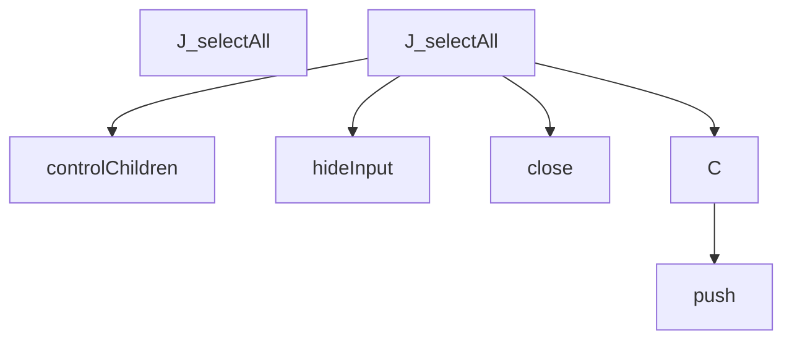

## Workflow: ModuleGuideGenerator.gather_data

The `gather_data` workflow represents a critical path in the system. When this flow is triggered, execution begins in `module_guide.py`. From there, it coordinates with 1 different components. The primary interactions involve `get_module_structure`.

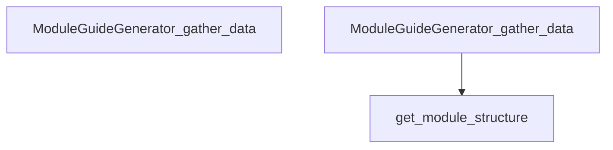

## Workflow: ProjectMapGenerator.gather_data

The `gather_data` workflow represents a critical path in the system. When this flow is triggered, execution begins in `project_map.py`. From there, it coordinates with 1 different components. The primary interactions involve `get_module_structure`.

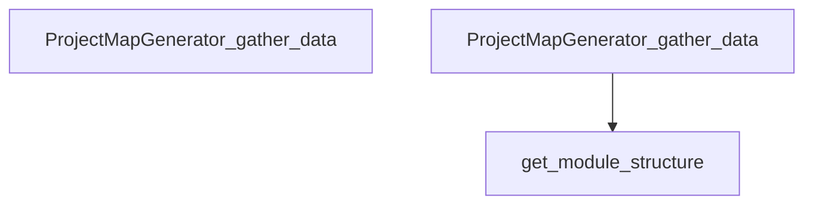

## Workflow: TestCppInheritance.test_inheritance_caller_is_child_class

The `test_inheritance_caller_is_child_class` workflow represents a critical path in the system. When this flow is triggered, execution begins in `test_inheritance.py`. From there, it coordinates with 3 different components. The primary interactions involve `dedent`, `any`, and `_parse`.

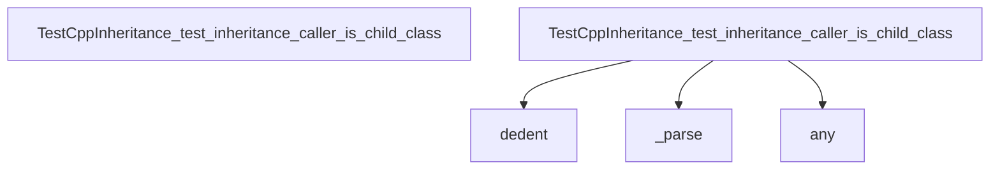

## Workflow: b.getScoreFunction

The `getScoreFunction` workflow represents a critical path in the system. When this flow is triggered, execution begins in `tom-select.complete.min.js`. From there, it coordinates with 2 different components. The primary interactions involve `prepareSearch` and `_getScoreFunction`.

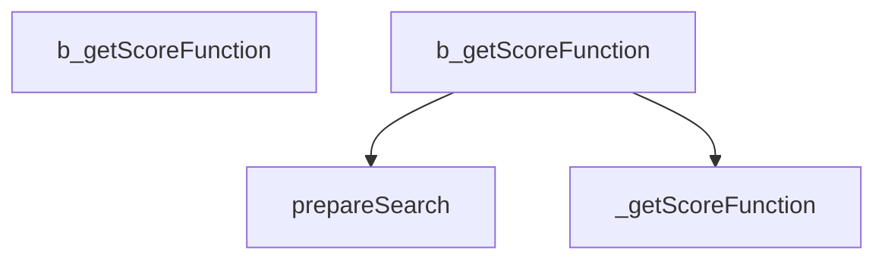

## Workflow: highlightFilter

The `highlightFilter` workflow represents a critical path in the system. When this flow is triggered, execution begins in `utils.js`. From there, it coordinates with 8 different components. The primary interactions involve `toString`, `update`, and `selectNodes`.

```mermaid
graph TD
    Start[highlightFilter]


    highlightFilter --> get


    highlightFilter --> includes


    highlightFilter --> toString


    highlightFilter --> push


    highlightFilter --> get


    highlightFilter --> includes


    highlightFilter --> toString


    highlightFilter --> push


    highlightFilter --> push


    highlightFilter --> selectNodes


    selectNodes --> selectNodes


    selectNodes --> filterHighlight


    filterHighlight --> get


    filterHighlight --> hasOwnProperty


    filterHighlight --> push


```

## Workflow: set_sqlite_pragma

The `set_sqlite_pragma` workflow represents a critical path in the system. When this flow is triggered, execution begins in `manager.py`. From there, it coordinates with 3 different components. The primary interactions involve `close`, `cursor`, and `execute`.

```mermaid
graph TD
    Start[set_sqlite_pragma]


    set_sqlite_pragma --> cursor


    set_sqlite_pragma --> execute


    set_sqlite_pragma --> execute


    set_sqlite_pragma --> execute


    set_sqlite_pragma --> execute


    set_sqlite_pragma --> close


```

## Workflow: test_cpp_inline_functions

The `test_cpp_inline_functions` workflow represents a critical path in the system. When this flow is triggered, execution begins in `test_cpp.py`. From there, it coordinates with 4 different components. The primary interactions involve `extract_symbols`, `len`, and `set_language`.

```mermaid
graph TD
    Start[test_cpp_inline_functions]


    test_cpp_inline_functions --> ASTParser


    test_cpp_inline_functions --> set_language


    test_cpp_inline_functions --> extract_symbols


    test_cpp_inline_functions --> len


```

## Workflow: test_find_callers_of_missing

The `test_find_callers_of_missing` workflow represents a critical path in the system. When this flow is triggered, execution begins in `test_query_api_references.py`. From there, it coordinates with 3 different components. The primary interactions involve `find_callers_of`, `len`, and `isinstance`.

```mermaid
graph TD
    Start[test_find_callers_of_missing]


    test_find_callers_of_missing --> find_callers_of


    test_find_callers_of_missing --> isinstance


    test_find_callers_of_missing --> len


```

## Workflow: test_find_calls_by_missing

The `test_find_calls_by_missing` workflow represents a critical path in the system. When this flow is triggered, execution begins in `test_query_api_references.py`. From there, it coordinates with 3 different components. The primary interactions involve `find_calls_by`, `len`, and `isinstance`.

```mermaid
graph TD
    Start[test_find_calls_by_missing]


    test_find_calls_by_missing --> find_calls_by


    test_find_calls_by_missing --> isinstance


    test_find_calls_by_missing --> len


```

## Workflow: test_js_basic_symbols

The `test_js_basic_symbols` workflow represents a critical path in the system. When this flow is triggered, execution begins in `test_javascript.py`. From there, it coordinates with 5 different components. The primary interactions involve `dedent`, `ASTParser`, and `len`.

```mermaid
graph TD
    Start[test_js_basic_symbols]


    test_js_basic_symbols --> ASTParser


    test_js_basic_symbols --> set_language


    test_js_basic_symbols --> dedent


    test_js_basic_symbols --> extract_symbols


    test_js_basic_symbols --> len


```

## Workflow: test_qa_sloppy_shebangs

The `test_qa_sloppy_shebangs` workflow represents a critical path in the system. When this flow is triggered, execution begins in `test_language_qa.py`. From there, it coordinates with 1 different components. The primary interactions involve `detect_language`.

```mermaid
graph TD
    Start[test_qa_sloppy_shebangs]


    test_qa_sloppy_shebangs --> detect_language


```


---
*Generated by DECODE NLG | [← Back to Index](index.md)*