# Data Flow
> **Onboarding question:** How does information move?


## Workflow: main

The `main` workflow represents a critical path in the system. When this flow is triggered, execution begins in `test_main.cpp`. From there, it coordinates with 82 different components. The primary interactions involve `Network`, `first`, and `in_`.

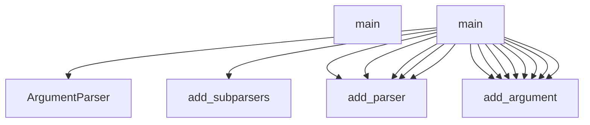

## Workflow: TestCppInheritance.test_cpp_function_calls_remain_call_kind

The `test_cpp_function_calls_remain_call_kind` workflow represents a critical path in the system. When this flow is triggered, execution begins in `test_inheritance.py`. From there, it coordinates with 2 different components. The primary interactions involve `len` and `_parse`.

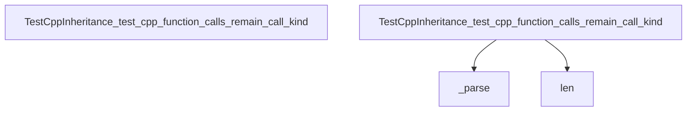

## Workflow: DBQueryAPI.get_domain_entities

The `get_domain_entities` workflow represents a critical path in the system. When this flow is triggered, execution begins in `query_api.py`. From there, it coordinates with 11 different components. The primary interactions involve `any`, `SessionLocal`, and `join`.

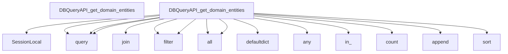

## Workflow: J.onClick

The `onClick` workflow represents a critical path in the system. When this flow is triggered, execution begins in `tom-select.complete.min.js`. From there, it coordinates with 3 different components. The primary interactions involve `clearActiveItems`, `focus`, and `blur`.

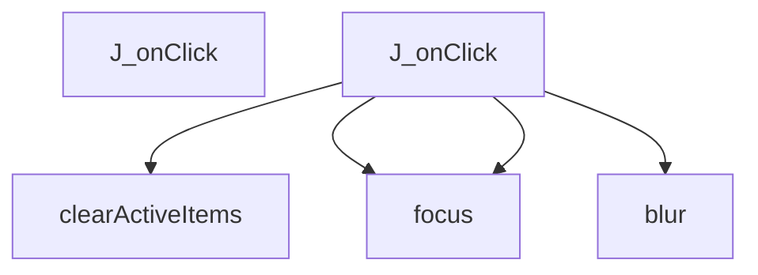

## Workflow: J.setup

The `setup` workflow represents a critical path in the system. When this flow is triggered, execution begins in `tom-select.complete.min.js`. From there, it coordinates with 57 different components. The primary interactions involve `preload`, `onFocus`, and `stopPropagation`.

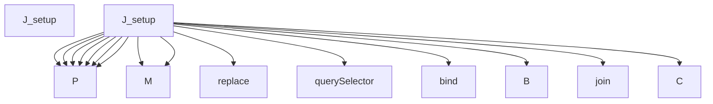

## Workflow: J.setupOptions

The `setupOptions` workflow represents a critical path in the system. When this flow is triggered, execution begins in `tom-select.complete.min.js`. From there, it coordinates with 3 different components. The primary interactions involve `registerOptionGroup`, `y`, and `addOptions`.

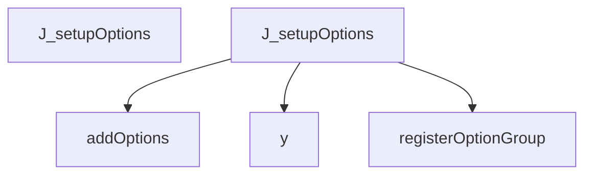

## Workflow: J.setupTemplates

The `setupTemplates` workflow represents a critical path in the system. When this flow is triggered, execution begins in `tom-select.complete.min.js`. From there, it coordinates with 73 different components. The primary interactions involve `random`, `vg`, and `split`.

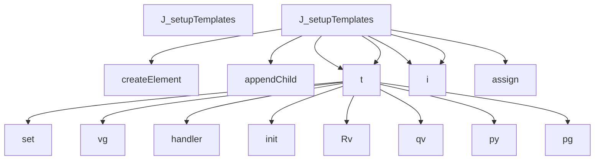

## Workflow: J.setupCallbacks

The `setupCallbacks` workflow represents a critical path in the system. When this flow is triggered, execution begins in `tom-select.complete.min.js`. From there, it coordinates with 1 different components. The primary interactions involve `on`.

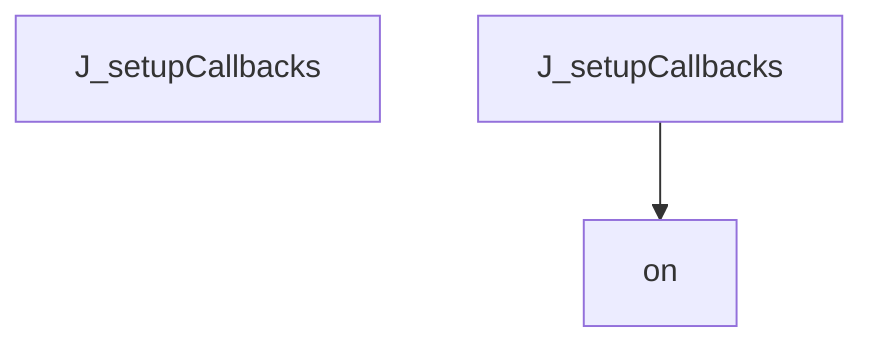

## Workflow: test_schema_setup

The `test_schema_setup` workflow represents a critical path in the system. When this flow is triggered, execution begins in `test_manager.py`. From there, it coordinates with 5 different components. The primary interactions involve `len`, `select`, and `SessionLocal`.

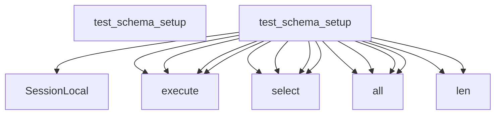

## Workflow: J.registerOption

The `registerOption` workflow represents a critical path in the system. When this flow is triggered, execution begins in `tom-select.complete.min.js`. From there, it coordinates with 1 different components. The primary interactions involve `addOption`.

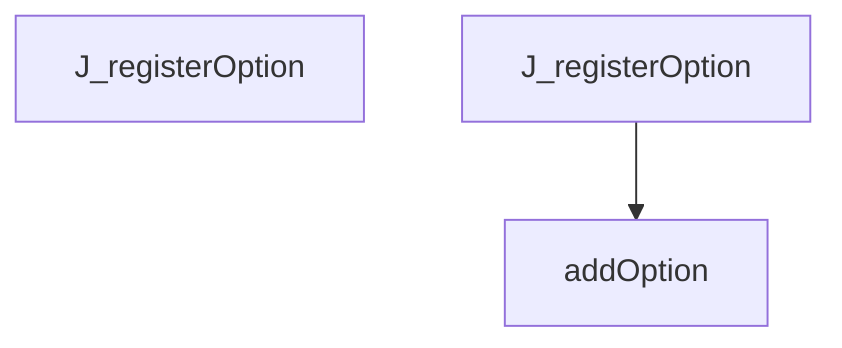

## Workflow: J.registerOptionGroup

The `registerOptionGroup` workflow represents a critical path in the system. When this flow is triggered, execution begins in `tom-select.complete.min.js`. From there, it coordinates with 1 different components. The primary interactions involve `q`.

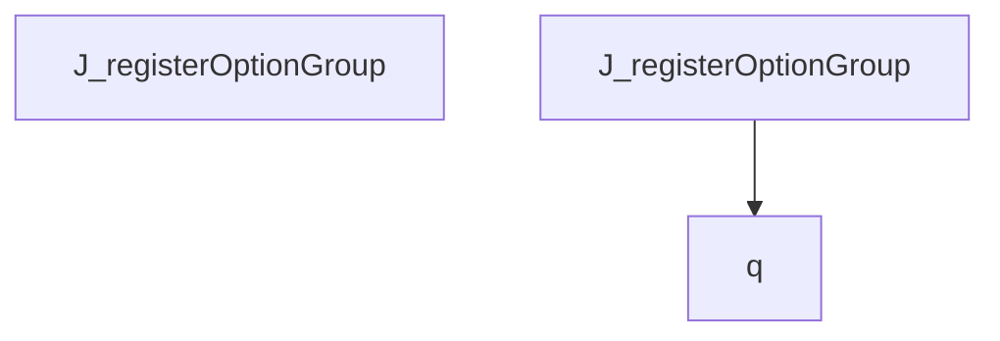

## Workflow: DBManager.ingest_project_data

The `ingest_project_data` workflow represents a critical path in the system. When this flow is triggered, execution begins in `manager.py`. From there, it coordinates with 7 different components. The primary interactions involve `len`, `SessionLocal`, and `execute`.

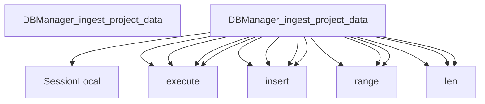

## Workflow: DBQueryAPI.find_files_importing

The `find_files_importing` workflow represents a critical path in the system. When this flow is triggered, execution begins in `query_api.py`. From there, it coordinates with 7 different components. The primary interactions involve `select`, `where`, and `SessionLocal`.

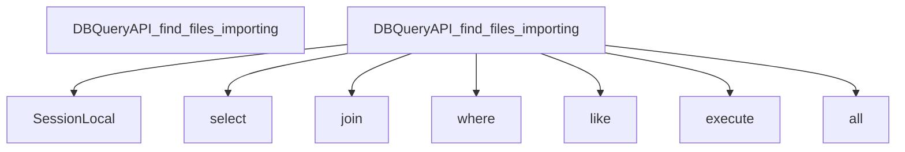

## Workflow: DBQueryAPI.get_class_hierarchy

The `get_class_hierarchy` workflow represents a critical path in the system. When this flow is triggered, execution begins in `query_api.py`. From there, it coordinates with 6 different components. The primary interactions involve `select`, `where`, and `SessionLocal`.

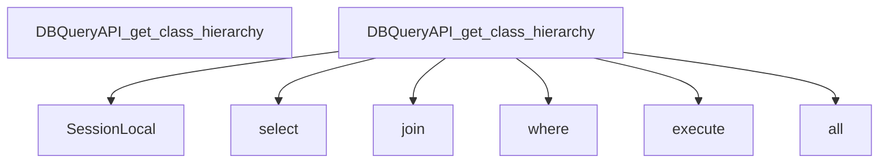

## Workflow: J.addOptionGroup

The `addOptionGroup` workflow represents a critical path in the system. When this flow is triggered, execution begins in `tom-select.complete.min.js`. From there, it coordinates with 2 different components. The primary interactions involve `registerOptionGroup` and `trigger`.

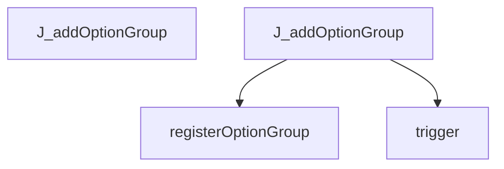

## Workflow: J.clearActiveItems

The `clearActiveItems` workflow represents a critical path in the system. When this flow is triggered, execution begins in `tom-select.complete.min.js`. From there, it coordinates with 1 different components. The primary interactions involve `S`.

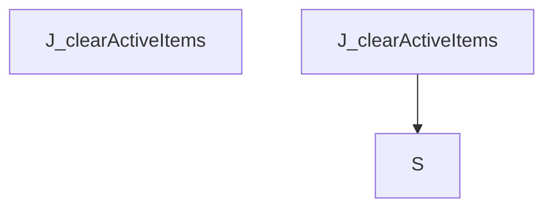

## Workflow: J.clearOptions

The `clearOptions` workflow represents a critical path in the system. When this flow is triggered, execution begins in `tom-select.complete.min.js`. From there, it coordinates with 4 different components. The primary interactions involve `clearCache`, `y`, and `trigger`.

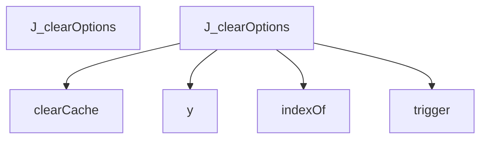

## Workflow: J.destroy

The `destroy` workflow represents a critical path in the system. When this flow is triggered, execution begins in `tom-select.complete.min.js`. From there, it coordinates with 5 different components. The primary interactions involve `trigger`, `_destroy`, and `off`.

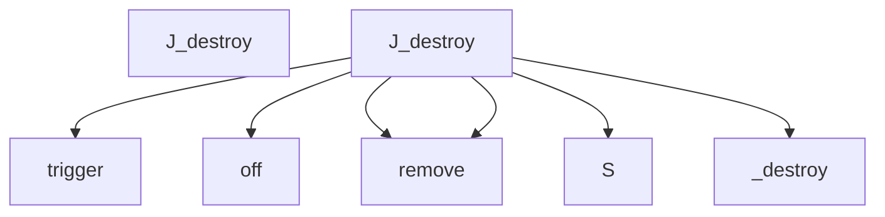

## Workflow: J.onInput

The `onInput` workflow represents a critical path in the system. When this flow is triggered, execution begins in `tom-select.complete.min.js`. From there, it coordinates with 5 different components. The primary interactions involve `trigger`, `load`, and `refreshOptions`.

```mermaid
graph TD
    Start[J_onInput]


    J_onInput --> inputValue


    J_onInput --> call


    J_onInput --> load


    J_onInput --> refreshOptions


    J_onInput --> trigger


```

## Workflow: J.selectable

The `selectable` workflow represents a critical path in the system. When this flow is triggered, execution begins in `tom-select.complete.min.js`. From there, it coordinates with 1 different components. The primary interactions involve `querySelectorAll`.

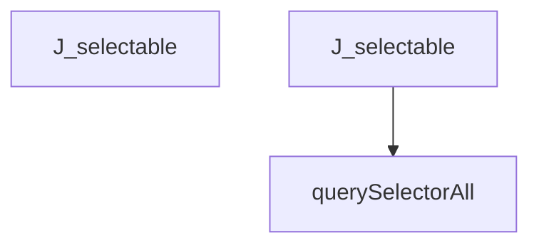

## Workflow: J.setActiveItemClass

The `setActiveItemClass` workflow represents a critical path in the system. When this flow is triggered, execution begins in `tom-select.complete.min.js`. From there, it coordinates with 6 different components. The primary interactions involve `trigger`, `push`, and `querySelector`.

```mermaid
graph TD
    Start[J_setActiveItemClass]


    J_setActiveItemClass --> querySelector


    J_setActiveItemClass --> S


    J_setActiveItemClass --> C


    J_setActiveItemClass --> trigger


    J_setActiveItemClass --> indexOf


    J_setActiveItemClass --> push


    C --> push


```

## Workflow: J.uncacheValue

The `uncacheValue` workflow represents a critical path in the system. When this flow is triggered, execution begins in `tom-select.complete.min.js`. From there, it coordinates with 2 different components. The primary interactions involve `remove` and `getOption`.

```mermaid
graph TD
    Start[J_uncacheValue]


    J_uncacheValue --> getOption


    J_uncacheValue --> remove


```

## Workflow: TestCppReturnTypes.test_bool_return_type

The `test_bool_return_type` workflow represents a critical path in the system. When this flow is triggered, execution begins in `test_return_types.py`. From there, it coordinates with 1 different components. The primary interactions involve `_parse`.

```mermaid
graph TD
    Start[TestCppReturnTypes_test_bool_return_type]


    TestCppReturnTypes_test_bool_return_type --> _parse


```

## Workflow: qg

The `qg` workflow represents a critical path in the system. When this flow is triggered, execution begins in `vis-network.min.js`. From there, it coordinates with 10 different components. The primary interactions involve `mg`, `jg`, and `push`.

```mermaid
graph TD
    Start[qg]


    qg --> jg


    qg --> jg


    qg --> filter


    qg --> mg


    qg --> push


    qg --> Rg


    qg --> concat


    jg --> call


    Rg --> Ig


    Rg --> push


    Rg --> sort


    Rg --> sort


    Ig --> indexOf


```

## Workflow: test_bash_basic_symbols

The `test_bash_basic_symbols` workflow represents a critical path in the system. When this flow is triggered, execution begins in `test_bash.py`. From there, it coordinates with 5 different components. The primary interactions involve `len`, `ASTParser`, and `dedent`.

```mermaid
graph TD
    Start[test_bash_basic_symbols]


    test_bash_basic_symbols --> ASTParser


    test_bash_basic_symbols --> set_language


    test_bash_basic_symbols --> dedent


    test_bash_basic_symbols --> extract_symbols


    test_bash_basic_symbols --> len


```

## Workflow: test_get_class_hierarchy_success

The `test_get_class_hierarchy_success` workflow represents a critical path in the system. When this flow is triggered, execution begins in `test_query_api_references.py`. From there, it coordinates with 2 different components. The primary interactions involve `len` and `get_class_hierarchy`.

```mermaid
graph TD
    Start[test_get_class_hierarchy_success]


    test_get_class_hierarchy_success --> get_class_hierarchy


    test_get_class_hierarchy_success --> len


```

## Workflow: test_get_file_outline_success

The `test_get_file_outline_success` workflow represents a critical path in the system. When this flow is triggered, execution begins in `test_query_api.py`. From there, it coordinates with 3 different components. The primary interactions involve `len`, `get_file_outline`, and `sorted`.

```mermaid
graph TD
    Start[test_get_file_outline_success]


    test_get_file_outline_success --> get_file_outline


    test_get_file_outline_success --> len


    test_get_file_outline_success --> sorted


```

## Workflow: test_js_es6_exports

The `test_js_es6_exports` workflow represents a critical path in the system. When this flow is triggered, execution begins in `test_javascript.py`. From there, it coordinates with 5 different components. The primary interactions involve `len`, `ASTParser`, and `extract_dependencies`.

```mermaid
graph TD
    Start[test_js_es6_exports]


    test_js_es6_exports --> ASTParser


    test_js_es6_exports --> set_language


    test_js_es6_exports --> dedent


    test_js_es6_exports --> extract_dependencies


    test_js_es6_exports --> len


```

## Workflow: test_remove_stale_files_cascade

The `test_remove_stale_files_cascade` workflow represents a critical path in the system. When this flow is triggered, execution begins in `test_manager.py`. From there, it coordinates with 7 different components. The primary interactions involve `len`, `SessionLocal`, and `first`.

```mermaid
graph TD
    Start[test_remove_stale_files_cascade]


    test_remove_stale_files_cascade --> SessionLocal


    test_remove_stale_files_cascade --> query


    test_remove_stale_files_cascade --> count


    test_remove_stale_files_cascade --> query


    test_remove_stale_files_cascade --> count


    test_remove_stale_files_cascade --> query


    test_remove_stale_files_cascade --> count


    test_remove_stale_files_cascade --> remove_stale_files


    test_remove_stale_files_cascade --> SessionLocal


    test_remove_stale_files_cascade --> query


    test_remove_stale_files_cascade --> count


    test_remove_stale_files_cascade --> query


    test_remove_stale_files_cascade --> first


    test_remove_stale_files_cascade --> query


    test_remove_stale_files_cascade --> all


```


---
*Generated by DECODE NLG | [← Back to Index](index.md)*