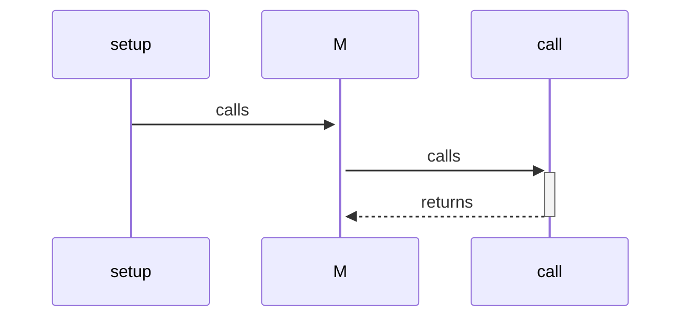

# Story of a Request
> **Onboarding question:** What happens when the application runs?

Execution begins at `setup`. It then passes control to `M`. Finally, the result is handled by `call`.

---
*Generated by DECODE NLG | [← Back to Index](index.md)*